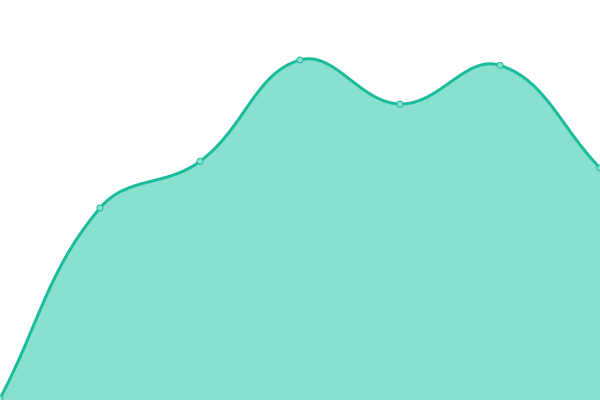
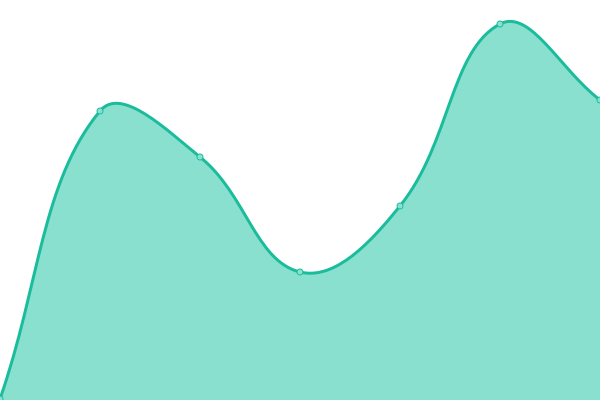
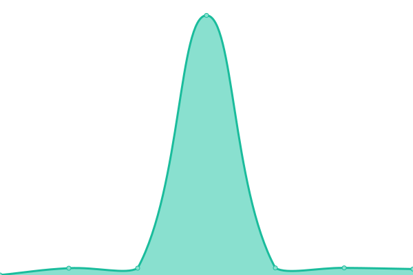
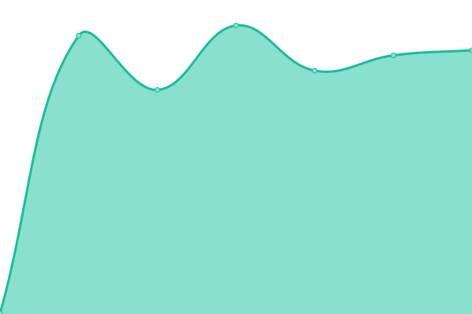
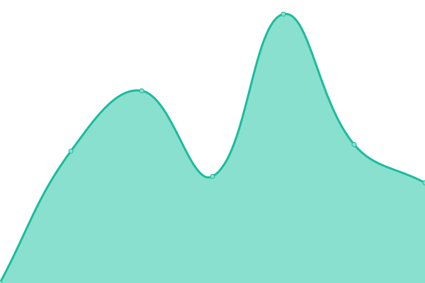
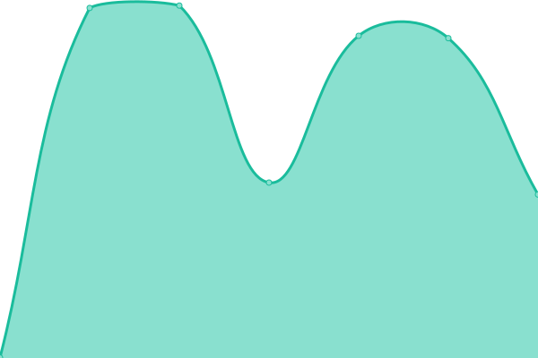

# [📈 Live Status](https://uptime.m17.link): <!--live status--> **🟧 Partial outage**

This repository contains the open-source uptime monitor and status page for [M17 Project](https://m17project.org/), powered by [Upptime](https://github.com/upptime/upptime).

With [Upptime](https://upptime.js.org), you can get your own unlimited and free uptime monitor and status page, powered entirely by a GitHub repository. We use [Issues](https://github.com/M17-Project/upptime/issues) as incident reports, [Actions](https://github.com/M17-Project/upptime/actions) as uptime monitors, and [Pages](https://uptime.m17.link) for the status page.

<!--start: status pages-->
<!-- This summary is generated by Upptime (https://github.com/upptime/upptime) -->
<!-- Do not edit this manually, your changes will be overwritten -->
<!-- prettier-ignore -->
| URL | Status | History | Response Time | Uptime |
| --- | ------ | ------- | ------------- | ------ |
|  [M17-020](https://m17-020.k2ie.net) | 🟩 Up | [m17-020.yml](https://github.com/M17-Project/upptime/commits/HEAD/history/m17-020.yml) | 

 238ms
     
 | 

<a href="https://uptime.m17.link/history/m17-020">100.00%</a>
    

|  [M17-033](https://m17-033.dyndns.org) | 🟩 Up | [m17-033.yml](https://github.com/M17-Project/upptime/commits/HEAD/history/m17-033.yml) | 

 623ms
     
 | 

<a href="https://uptime.m17.link/history/m17-033">100.00%</a>
    

|  [M17-090](https://m17090.radiotechnology.xyz) | 🟥 Down | [m17-090.yml](https://github.com/M17-Project/upptime/commits/HEAD/history/m17-090.yml) | 

 0ms
     
 | 

<a href="https://uptime.m17.link/history/m17-090">0.00%</a>
    

|  [M17-190](https://m17.argentina.net) | 🟥 Down | [m17-190.yml](https://github.com/M17-Project/upptime/commits/HEAD/history/m17-190.yml) | 

 0ms
     
 | 

<a href="https://uptime.m17.link/history/m17-190">0.00%</a>
    

|  [M17-201](https://m17.xlx201.uk) | 🟩 Up | [m17-201.yml](https://github.com/M17-Project/upptime/commits/HEAD/history/m17-201.yml) | 

 476ms
     
 | 

<a href="https://uptime.m17.link/history/m17-201">99.79%</a>
    

|  [M17-214](https://214.m17.es/) | 🟥 Down | [m17-214.yml](https://github.com/M17-Project/upptime/commits/HEAD/history/m17-214.yml) | 

 0ms
     
 | 

<a href="https://uptime.m17.link/history/m17-214">0.00%</a>
    

|  [M17-216](https://xlx216.km8v.com/m17) | 🟩 Up | [m17-216.yml](https://github.com/M17-Project/upptime/commits/HEAD/history/m17-216.yml) | 

 355ms
     
 | 

<a href="https://uptime.m17.link/history/m17-216">100.00%</a>
    

|  [M17-224](https://eamaster.xreflector.es/m17/) | 🟥 Down | [m17-224.yml](https://github.com/M17-Project/upptime/commits/HEAD/history/m17-224.yml) | 

 0ms
     
 | 

<a href="https://uptime.m17.link/history/m17-224">0.00%</a>
    

|  [M17-239](https://m17.ac8zd.com) | 🟩 Up | [m17-239.yml](https://github.com/M17-Project/upptime/commits/HEAD/history/m17-239.yml) | 

 263ms
     
 | 

<a href="https://uptime.m17.link/history/m17-239">100.00%</a>
    

|  [M17-245](https://m17245.ddns.net) | 🟥 Down | [m17-245.yml](https://github.com/M17-Project/upptime/commits/HEAD/history/m17-245.yml) | 

 0ms
     
 | 

<a href="https://uptime.m17.link/history/m17-245">0.00%</a>
    

|  [M17-334](https://m17.radiotechnology.xyz) | 🟥 Down | [m17-334.yml](https://github.com/M17-Project/upptime/commits/HEAD/history/m17-334.yml) | 

 0ms
     
 | 

<a href="https://uptime.m17.link/history/m17-334">0.00%</a>
    

|  [M17-432](https://m17.vkradio.com) | 🟩 Up | [m17-432.yml](https://github.com/M17-Project/upptime/commits/HEAD/history/m17-432.yml) | 

 1004ms
     
 | 

<a href="https://uptime.m17.link/history/m17-432">100.00%</a>
    

|  [M17-659](https://m17.af0ss.org) | 🟥 Down | [m17-659.yml](https://github.com/M17-Project/upptime/commits/HEAD/history/m17-659.yml) | 

 0ms
     
 | 

<a href="https://uptime.m17.link/history/m17-659">0.00%</a>
    

|  [M17-672](https://multi-reflector.pistar.uk/) | 🟩 Up | [m17-672.yml](https://github.com/M17-Project/upptime/commits/HEAD/history/m17-672.yml) | 

 349ms
     
 | 

<a href="https://uptime.m17.link/history/m17-672">100.00%</a>
    

|  [M17-714](https://m17.ea3hkb.cat) | 🟥 Down | [m17-714.yml](https://github.com/M17-Project/upptime/commits/HEAD/history/m17-714.yml) | 

 839ms
     
 | 

<a href="https://uptime.m17.link/history/m17-714">72.24%</a>
    

|  [M17-724](https://allfive.net/indexm17.php) | 🟥 Down | [m17-724.yml](https://github.com/M17-Project/upptime/commits/HEAD/history/m17-724.yml) | 

 0ms
     
 | 

<a href="https://uptime.m17.link/history/m17-724">0.00%</a>
    

|  [M17-727](https://m17-727.ddns.net) | 🟥 Down | [m17-727.yml](https://github.com/M17-Project/upptime/commits/HEAD/history/m17-727.yml) | 

 0ms
     
 | 

<a href="https://uptime.m17.link/history/m17-727">0.00%</a>
    

|  [M17-910](https://m17.mywire.org) | 🟩 Up | [m17-910.yml](https://github.com/M17-Project/upptime/commits/HEAD/history/m17-910.yml) | 

 277ms
     
 | 

<a href="https://uptime.m17.link/history/m17-910">100.00%</a>
    

|  [M17-983](https://M17-983.k8jtk.org/) | 🟩 Up | [m17-983.yml](https://github.com/M17-Project/upptime/commits/HEAD/history/m17-983.yml) | 

 267ms
     
 | 

<a href="https://uptime.m17.link/history/m17-983">100.00%</a>
    

|  [M17-AND](https://m17and.xreflector.es/m17) | 🟩 Up | [m17-and.yml](https://github.com/M17-Project/upptime/commits/HEAD/history/m17-and.yml) | 

 535ms
     
 | 

<a href="https://uptime.m17.link/history/m17-and">100.00%</a>
    

|  [M17-ARG](https://m17arg.ddns.net/) | 🟥 Down | [m17-arg.yml](https://github.com/M17-Project/upptime/commits/HEAD/history/m17-arg.yml) | 

 0ms
     
 | 

<a href="https://uptime.m17.link/history/m17-arg">100.00%</a>
    

|  [M17-ASL](https://m17.51593.it/) | 🟥 Down | [m17-asl.yml](https://github.com/M17-Project/upptime/commits/HEAD/history/m17-asl.yml) | 

 0ms
     
 | 

<a href="https://uptime.m17.link/history/m17-asl">0.00%</a>
    

|  [M17-AUS](https://m17aus.drgnz.com/) | 🟥 Down | [m17-aus.yml](https://github.com/M17-Project/upptime/commits/HEAD/history/m17-aus.yml) | 

 0ms
     
 | 

<a href="https://uptime.m17.link/history/m17-aus">0.00%</a>
    

|  [M17-AUT](https://m17-aut.xreflector.net/) | 🟩 Up | [m17-aut.yml](https://github.com/M17-Project/upptime/commits/HEAD/history/m17-aut.yml) | 

 587ms
     
 | 

<a href="https://uptime.m17.link/history/m17-aut">100.00%</a>
    

|  [M17-BEL](https://on0lg.no-ip.org/m17bel) | 🟩 Up | [m17-bel.yml](https://github.com/M17-Project/upptime/commits/HEAD/history/m17-bel.yml) | 

 979ms
     
 | 

<a href="https://uptime.m17.link/history/m17-bel">99.40%</a>
    

|  [M17-BRA](https://m17bra.net) | 🟩 Up | [m17-bra.yml](https://github.com/M17-Project/upptime/commits/HEAD/history/m17-bra.yml) | 

 581ms
     
 | 

<a href="https://uptime.m17.link/history/m17-bra">99.14%</a>
    

|  [M17-BRO](https://m17-bro.dudetronics.com) | 🟥 Down | [m17-bro.yml](https://github.com/M17-Project/upptime/commits/HEAD/history/m17-bro.yml) | 

 0ms
     
 | 

<a href="https://uptime.m17.link/history/m17-bro">0.00%</a>
    

|  [M17-CAD](http://ontxlink.hopto.org/m17/index.php) | 🟩 Up | [m17-cad.yml](https://github.com/M17-Project/upptime/commits/HEAD/history/m17-cad.yml) | 

 174ms
     
 | 

<a href="https://uptime.m17.link/history/m17-cad">100.00%</a>
    

|  [M17-CAN](https://m17-ve3rig.ddns.net) | 🟥 Down | [m17-can.yml](https://github.com/M17-Project/upptime/commits/HEAD/history/m17-can.yml) | 

 0ms
     
 | 

<a href="https://uptime.m17.link/history/m17-can">0.00%</a>
    

|  [M17-CAS](https://castellar.m17.es/m17/) | 🟥 Down | [m17-cas.yml](https://github.com/M17-Project/upptime/commits/HEAD/history/m17-cas.yml) | 

 0ms
     
 | 

<a href="https://uptime.m17.link/history/m17-cas">0.00%</a>
    

|  [M17-CAT](https://m17catalonia.ddns.net/) | 🟥 Down | [m17-cat.yml](https://github.com/M17-Project/upptime/commits/HEAD/history/m17-cat.yml) | 

 0ms
     
 | 

<a href="https://uptime.m17.link/history/m17-cat">0.00%</a>
    

|  [M17-CCV](https://m17.owari.biz/ref-dash) | 🟩 Up | [m17-ccv.yml](https://github.com/M17-Project/upptime/commits/HEAD/history/m17-ccv.yml) | 

 4804ms
     
 | 

<a href="https://uptime.m17.link/history/m17-ccv">100.00%</a>
    

|  [M17-CHI](https://m17ch-italia.ddns.net/) | 🟩 Up | [m17-chi.yml](https://github.com/M17-Project/upptime/commits/HEAD/history/m17-chi.yml) | 

 547ms
     
 | 

<a href="https://uptime.m17.link/history/m17-chi">100.00%</a>
    

|  [M17-CL1](https://m17.radioaficion.pro/) | 🟩 Up | [m17-cl-1.yml](https://github.com/M17-Project/upptime/commits/HEAD/history/m17-cl-1.yml) | 

 623ms
     
 | 

<a href="https://uptime.m17.link/history/m17-cl-1">99.79%</a>
    

|  [M17-DDI](https://m17.dodropin.net) | 🟥 Down | [m17-ddi.yml](https://github.com/M17-Project/upptime/commits/HEAD/history/m17-ddi.yml) | 

 0ms
     
 | 

<a href="https://uptime.m17.link/history/m17-ddi">0.00%</a>
    

|  [M17-DEU](https://m17-deu.xreflector.net/) | 🟩 Up | [m17-deu.yml](https://github.com/M17-Project/upptime/commits/HEAD/history/m17-deu.yml) | 

 450ms
     
 | 

<a href="https://uptime.m17.link/history/m17-deu">100.00%</a>
    

|  [M17-DEV](https://tarxvf.tech/) | 🟩 Up | [m17-dev.yml](https://github.com/M17-Project/upptime/commits/HEAD/history/m17-dev.yml) | 

 275ms
     
 | 

<a href="https://uptime.m17.link/history/m17-dev">100.00%</a>
    

|  [M17-DMR](https://m17.freestar.network) | 🟩 Up | [m17-dmr.yml](https://github.com/M17-Project/upptime/commits/HEAD/history/m17-dmr.yml) | 

 852ms
     
 | 

<a href="https://uptime.m17.link/history/m17-dmr">99.63%</a>
    

|  [M17-EA1](https://eadistrito1.m17.es/m17/) | 🟩 Up | [m17-ea-1.yml](https://github.com/M17-Project/upptime/commits/HEAD/history/m17-ea-1.yml) | 

 696ms
     
 | 

<a href="https://uptime.m17.link/history/m17-ea-1">100.00%</a>
    

|  [M17-EA2](https://ea2bkh.m17.es/m17/) | 🟥 Down | [m17-ea-2.yml](https://github.com/M17-Project/upptime/commits/HEAD/history/m17-ea-2.yml) | 

 0ms
     
 | 

<a href="https://uptime.m17.link/history/m17-ea-2">0.00%</a>
    

|  [M17-EA4](https://ea4rcr.m17.es/m17/) | 🟥 Down | [m17-ea-4.yml](https://github.com/M17-Project/upptime/commits/HEAD/history/m17-ea-4.yml) | 

 0ms
     
 | 

<a href="https://uptime.m17.link/history/m17-ea-4">0.00%</a>
    

|  [M17-EA7](https://rcveleta.xreflector.es/) | 🟥 Down | [m17-ea-7.yml](https://github.com/M17-Project/upptime/commits/HEAD/history/m17-ea-7.yml) | 

 0ms
     
 | 

<a href="https://uptime.m17.link/history/m17-ea-7">0.00%</a>
    

|  [M17-EA8](https://ea8ee.m17.es/m17/) | 🟥 Down | [m17-ea-8.yml](https://github.com/M17-Project/upptime/commits/HEAD/history/m17-ea-8.yml) | 

 0ms
     
 | 

<a href="https://uptime.m17.link/history/m17-ea-8">0.00%</a>
    

|  [M17-ESP](https://m17spa.xreflector.es/) | 🟩 Up | [m17-esp.yml](https://github.com/M17-Project/upptime/commits/HEAD/history/m17-esp.yml) | 

 711ms
     
 | 

<a href="https://uptime.m17.link/history/m17-esp">100.00%</a>
    

|  [M17-FIN](https://openvpn.fi/M17/) | 🟥 Down | [m17-fin.yml](https://github.com/M17-Project/upptime/commits/HEAD/history/m17-fin.yml) | 

 0ms
     
 | 

<a href="https://uptime.m17.link/history/m17-fin">0.00%</a>
    

|  [M17-FOG](https://m17.ham-radio-fog.org/) | 🟩 Up | [m17-fog.yml](https://github.com/M17-Project/upptime/commits/HEAD/history/m17-fog.yml) | 

 378ms
     
 | 

<a href="https://uptime.m17.link/history/m17-fog">100.00%</a>
    

|  [M17-FRA](https://m17-fra.f5dan.fr) | 🟩 Up | [m17-fra.yml](https://github.com/M17-Project/upptime/commits/HEAD/history/m17-fra.yml) | 

 586ms
     
 | 

<a href="https://uptime.m17.link/history/m17-fra">100.00%</a>
    

|  [M17-FVG](https://m17fvg.hblink.it) | 🟩 Up | [m17-fvg.yml](https://github.com/M17-Project/upptime/commits/HEAD/history/m17-fvg.yml) | 

 749ms
     
 | 

<a href="https://uptime.m17.link/history/m17-fvg">100.00%</a>
    

|  [M17-GAX](https://ea4gax.es/M17/) | 🟩 Up | [m17-gax.yml](https://github.com/M17-Project/upptime/commits/HEAD/history/m17-gax.yml) | 

 605ms
     
 | 

<a href="https://uptime.m17.link/history/m17-gax">100.00%</a>
    

|  [M17-GBR](https://www.m0iqf.online/m17/) | 🟩 Up | [m17-gbr.yml](https://github.com/M17-Project/upptime/commits/HEAD/history/m17-gbr.yml) | 

 630ms
     
 | 

<a href="https://uptime.m17.link/history/m17-gbr">100.00%</a>
    

|  [M17-GSP](https://xlxsof.ddns.net:17001) | 🟥 Down | [m17-gsp.yml](https://github.com/M17-Project/upptime/commits/HEAD/history/m17-gsp.yml) | 

 0ms
     
 | 

<a href="https://uptime.m17.link/history/m17-gsp">0.00%</a>
    

|  [M17-HAM](https://m17-ham.ddns.net/) | 🟩 Up | [m17-ham.yml](https://github.com/M17-Project/upptime/commits/HEAD/history/m17-ham.yml) | 

 201ms
     
 | 

<a href="https://uptime.m17.link/history/m17-ham">100.00%</a>
    

|  [M17-HNC](https://certspain.ddns.net) | 🟥 Down | [m17-hnc.yml](https://github.com/M17-Project/upptime/commits/HEAD/history/m17-hnc.yml) | 

 0ms
     
 | 

<a href="https://uptime.m17.link/history/m17-hnc">0.00%</a>
    

|  [M17-HRV](https://m17.hamvillage.org) | 🟩 Up | [m17-hrv.yml](https://github.com/M17-Project/upptime/commits/HEAD/history/m17-hrv.yml) | 

 348ms
     
 | 

<a href="https://uptime.m17.link/history/m17-hrv">100.00%</a>
    

|  [M17-HUB](https://g7rpg.hubnetwork.uk/m17) | 🟩 Up | [m17-hub.yml](https://github.com/M17-Project/upptime/commits/HEAD/history/m17-hub.yml) | 

 939ms
     
 | 

<a href="https://uptime.m17.link/history/m17-hub">0.00%</a>
    

|  [M17-IND](https://ysf-india.ddns.net/) | 🟥 Down | [m17-ind.yml](https://github.com/M17-Project/upptime/commits/HEAD/history/m17-ind.yml) | 

 0ms
     
 | 

<a href="https://uptime.m17.link/history/m17-ind">0.00%</a>
    

|  [M17-IRN](https://m17.irn.radio) | 🟥 Down | [m17-irn.yml](https://github.com/M17-Project/upptime/commits/HEAD/history/m17-irn.yml) | 

 0ms
     
 | 

<a href="https://uptime.m17.link/history/m17-irn">0.00%</a>
    

|  [M17-IS0](https://m17.is0.org/) | 🟩 Up | [m17-is-0.yml](https://github.com/M17-Project/upptime/commits/HEAD/history/m17-is-0.yml) | 

 1017ms
     
 | 

<a href="https://uptime.m17.link/history/m17-is-0">100.00%</a>
    

|  [M17-ITA](https://m17ita.hblink.it) | 🟩 Up | [m17-ita.yml](https://github.com/M17-Project/upptime/commits/HEAD/history/m17-ita.yml) | 

 751ms
     
 | 

<a href="https://uptime.m17.link/history/m17-ita">100.00%</a>
    

|  [M17-ITD](https://m17.itdmr.it) | 🟥 Down | [m17-itd.yml](https://github.com/M17-Project/upptime/commits/HEAD/history/m17-itd.yml) | 

 0ms
     
 | 

<a href="https://uptime.m17.link/history/m17-itd">0.00%</a>
    

|  [M17-JAX](https://m17-jax.f5.si:8800/) | 🟥 Down | [m17-jax.yml](https://github.com/M17-Project/upptime/commits/HEAD/history/m17-jax.yml) | 

 0ms
     
 | 

<a href="https://uptime.m17.link/history/m17-jax">0.00%</a>
    

|  [M17-JP1](https://m17.jh1blt.net/m17/) | 🟥 Down | [m17-jp-1.yml](https://github.com/M17-Project/upptime/commits/HEAD/history/m17-jp-1.yml) | 

 0ms
     
 | 

<a href="https://uptime.m17.link/history/m17-jp-1">0.00%</a>
    

|  [M17-JPN](https://m17.f5.si/) | 🟥 Down | [m17-jpn.yml](https://github.com/M17-Project/upptime/commits/HEAD/history/m17-jpn.yml) | 

 0ms
     
 | 

<a href="https://uptime.m17.link/history/m17-jpn">0.00%</a>
    

|  [M17-JWG](https://m17.jwgtechs.com) | 🟩 Up | [m17-jwg.yml](https://github.com/M17-Project/upptime/commits/HEAD/history/m17-jwg.yml) | 

 200ms
     
 | 

<a href="https://uptime.m17.link/history/m17-jwg">99.77%</a>
    

|  [M17-KP4](https://kp4ca-m17.ddns.net/) | 🟥 Down | [m17-kp-4.yml](https://github.com/M17-Project/upptime/commits/HEAD/history/m17-kp-4.yml) | 

 0ms
     
 | 

<a href="https://uptime.m17.link/history/m17-kp-4">0.00%</a>
    

|  [M17-KPH](https://m17.kapihan.net) | 🟩 Up | [m17-kph.yml](https://github.com/M17-Project/upptime/commits/HEAD/history/m17-kph.yml) | 

 323ms
     
 | 

<a href="https://uptime.m17.link/history/m17-kph">100.00%</a>
    

|  [M17-LAT](https://latinos.m17.es/m17/) | 🟩 Up | [m17-lat.yml](https://github.com/M17-Project/upptime/commits/HEAD/history/m17-lat.yml) | 

 560ms
     
 | 

<a href="https://uptime.m17.link/history/m17-lat">100.00%</a>
    

|  [M17-LDV](https://ldv.m17.es/m17/) | 🟥 Down | [m17-ldv.yml](https://github.com/M17-Project/upptime/commits/HEAD/history/m17-ldv.yml) | 

 0ms
     
 | 

<a href="https://uptime.m17.link/history/m17-ldv">0.00%</a>
    

|  [M17-LSC](https://ke4tlc.ddns.net) | 🟩 Up | [m17-lsc.yml](https://github.com/M17-Project/upptime/commits/HEAD/history/m17-lsc.yml) | 

 314ms
     
 | 

<a href="https://uptime.m17.link/history/m17-lsc">100.00%</a>
    

|  [M17-M17](https://ref.m17.link) | 🟩 Up | [m17-m17.yml](https://github.com/M17-Project/upptime/commits/HEAD/history/m17-m17.yml) | 

 223ms
     
 | 

<a href="https://uptime.m17.link/history/m17-m17">100.00%</a>
    

|  [M17-NOR](https://m17.la2k.no) | 🟩 Up | [m17-nor.yml](https://github.com/M17-Project/upptime/commits/HEAD/history/m17-nor.yml) | 

 617ms
     
 | 

<a href="https://uptime.m17.link/history/m17-nor">100.00%</a>
    

|  [M17-NWR](https://m17.nwrg.org.uk) | 🟩 Up | [m17-nwr.yml](https://github.com/M17-Project/upptime/commits/HEAD/history/m17-nwr.yml) | 

 647ms
     
 | 

<a href="https://uptime.m17.link/history/m17-nwr">100.00%</a>
    

|  [M17-NYC](https://kd2uqk.ham-radio-op.net) | 🟥 Down | [m17-nyc.yml](https://github.com/M17-Project/upptime/commits/HEAD/history/m17-nyc.yml) | 

 0ms
     
 | 

<a href="https://uptime.m17.link/history/m17-nyc">0.00%</a>
    

|  [M17-NZD](https://m17-nzd.m1m0n.net) | 🟩 Up | [m17-nzd.yml](https://github.com/M17-Project/upptime/commits/HEAD/history/m17-nzd.yml) | 

 1338ms
     
 | 

<a href="https://uptime.m17.link/history/m17-nzd">99.85%</a>
    

|  [M17-NZL](https://m17nzl.drgnz.com/) | 🟥 Down | [m17-nzl.yml](https://github.com/M17-Project/upptime/commits/HEAD/history/m17-nzl.yml) | 

 0ms
     
 | 

<a href="https://uptime.m17.link/history/m17-nzl">0.00%</a>
    

|  [M17-OFW](https://ofwham.duckdns.org/index.php) | 🟥 Down | [m17-ofw.yml](https://github.com/M17-Project/upptime/commits/HEAD/history/m17-ofw.yml) | 

 0ms
     
 | 

<a href="https://uptime.m17.link/history/m17-ofw">0.00%</a>
    

|  [M17-OH6](https://m17oh6.ddns.net/) | 🟩 Up | [m17-oh-6.yml](https://github.com/M17-Project/upptime/commits/HEAD/history/m17-oh-6.yml) | 

 476ms
     
 | 

<a href="https://uptime.m17.link/history/m17-oh-6">100.00%</a>
    

|  [M17-OSK](https://www.ne.jp/asahi/radio/ham) | 🟥 Down | [m17-osk.yml](https://github.com/M17-Project/upptime/commits/HEAD/history/m17-osk.yml) | 

 916ms
     
 | 

<a href="https://uptime.m17.link/history/m17-osk">0.00%</a>
    

|  [M17-OWL](https://xlx508.hb9gfx.ch/M17-Reflector-Dashboard/index.php) | 🟩 Up | [m17-owl.yml](https://github.com/M17-Project/upptime/commits/HEAD/history/m17-owl.yml) | 

 607ms
     
 | 

<a href="https://uptime.m17.link/history/m17-owl">100.00%</a>
    

|  [M17-OZD](https://m17.oz-dmr.uk/) | 🟥 Down | [m17-ozd.yml](https://github.com/M17-Project/upptime/commits/HEAD/history/m17-ozd.yml) | 

 0ms
     
 | 

<a href="https://uptime.m17.link/history/m17-ozd">0.00%</a>
    

|  [M17-PEG](https://dmr.projekt-pegasus.net/m17/) | 🟩 Up | [m17-peg.yml](https://github.com/M17-Project/upptime/commits/HEAD/history/m17-peg.yml) | 

 580ms
     
 | 

<a href="https://uptime.m17.link/history/m17-peg">100.00%</a>
    

|  [M17-PER](https://m17.dmr-peru.pe) | 🟩 Up | [m17-per.yml](https://github.com/M17-Project/upptime/commits/HEAD/history/m17-per.yml) | 

 651ms
     
 | 

<a href="https://uptime.m17.link/history/m17-per">99.71%</a>
    

|  [M17-PHP](https://dx8wmg-m17.ddns.net/) | 🟥 Down | [m17-php.yml](https://github.com/M17-Project/upptime/commits/HEAD/history/m17-php.yml) | 

 0ms
     
 | 

<a href="https://uptime.m17.link/history/m17-php">0.00%</a>
    

|  [M17-PLC](https://bulgaria.ddns.net:17001) | 🟥 Down | [m17-plc.yml](https://github.com/M17-Project/upptime/commits/HEAD/history/m17-plc.yml) | 

 0ms
     
 | 

<a href="https://uptime.m17.link/history/m17-plc">0.00%</a>
    

|  [M17-PLG](https://xrf245.pennlinkgroup.com/mrefd/) | 🟩 Up | [m17-plg.yml](https://github.com/M17-Project/upptime/commits/HEAD/history/m17-plg.yml) | 

 240ms
     
 | 

<a href="https://uptime.m17.link/history/m17-plg">100.00%</a>
    

|  [M17-PNL](https://m17.pinoylink.net) | 🟥 Down | [m17-pnl.yml](https://github.com/M17-Project/upptime/commits/HEAD/history/m17-pnl.yml) | 

 264ms
     
 | 

<a href="https://uptime.m17.link/history/m17-pnl">73.77%</a>
    

|  [M17-POL](https://m17.hblink.network/) | 🟩 Up | [m17-pol.yml](https://github.com/M17-Project/upptime/commits/HEAD/history/m17-pol.yml) | 

 830ms
     
 | 

<a href="https://uptime.m17.link/history/m17-pol">100.00%</a>
    

|  [M17-POR](https://m17.hamradio.pt/) | 🟩 Up | [m17-por.yml](https://github.com/M17-Project/upptime/commits/HEAD/history/m17-por.yml) | 

 717ms
     
 | 

<a href="https://uptime.m17.link/history/m17-por">100.00%</a>
    

|  [M17-QUE](https://m17-que.ddns.net) | 🟩 Up | [m17-que.yml](https://github.com/M17-Project/upptime/commits/HEAD/history/m17-que.yml) | 

 220ms
     
 | 

<a href="https://uptime.m17.link/history/m17-que">100.00%</a>
    

|  [M17-RE1](https://m17-fra.f5dan.fr/) | 🟩 Up | [m17-re-1.yml](https://github.com/M17-Project/upptime/commits/HEAD/history/m17-re-1.yml) | 

 575ms
     
 | 

<a href="https://uptime.m17.link/history/m17-re-1">100.00%</a>
    

|  [M17-ROM](https://tetra-romania.ddns.net/m17/) | 🟩 Up | [m17-rom.yml](https://github.com/M17-Project/upptime/commits/HEAD/history/m17-rom.yml) | 

 492ms
     
 | 

<a href="https://uptime.m17.link/history/m17-rom">100.00%</a>
    

|  [M17-RTX](https://m17.openrtx.org) | 🟩 Up | [m17-rtx.yml](https://github.com/M17-Project/upptime/commits/HEAD/history/m17-rtx.yml) | 

 521ms
     
 | 

<a href="https://uptime.m17.link/history/m17-rtx">96.62%</a>
    

|  [M17-SCS](https://m17-scarsvoip.com/) | 🟩 Up | [m17-scs.yml](https://github.com/M17-Project/upptime/commits/HEAD/history/m17-scs.yml) | 

 349ms
     
 | 

<a href="https://uptime.m17.link/history/m17-scs">100.00%</a>
    

|  [M17-SEL](https://selink.lmarc.net/m17dash) | 🟩 Up | [m17-sel.yml](https://github.com/M17-Project/upptime/commits/HEAD/history/m17-sel.yml) | 

 218ms
     
 | 

<a href="https://uptime.m17.link/history/m17-sel">100.00%</a>
    

|  [M17-SPA](https://hblinkspain.duckdns.org/mrefd/) | 🟩 Up | [m17-spa.yml](https://github.com/M17-Project/upptime/commits/HEAD/history/m17-spa.yml) | 

 575ms
     
 | 

<a href="https://uptime.m17.link/history/m17-spa">100.00%</a>
    

|  [M17-SUN](https://kc5fm.ddns.net/m17ref/) | 🟥 Down | [m17-sun.yml](https://github.com/M17-Project/upptime/commits/HEAD/history/m17-sun.yml) | 

 0ms
     
 | 

<a href="https://uptime.m17.link/history/m17-sun">0.00%</a>
    

|  [M17-SWD](https://m17-ref2-swdg.net/) | 🟩 Up | [m17-swd.yml](https://github.com/M17-Project/upptime/commits/HEAD/history/m17-swd.yml) | 

 515ms
     
 | 

<a href="https://uptime.m17.link/history/m17-swd">100.00%</a>
    

|  [M17-SWE](https://m17.amprnet.se) | 🟩 Up | [m17-swe.yml](https://github.com/M17-Project/upptime/commits/HEAD/history/m17-swe.yml) | 

 816ms
     
 | 

<a href="https://uptime.m17.link/history/m17-swe">100.00%</a>
    

|  [M17-TAR](https://tarxvf.tech) | 🟩 Up | [m17-tar.yml](https://github.com/M17-Project/upptime/commits/HEAD/history/m17-tar.yml) | 

 343ms
     
 | 

<a href="https://uptime.m17.link/history/m17-tar">100.00%</a>
    

|  [M17-THA](https://m17.dprns.com) | 🟩 Up | [m17-tha.yml](https://github.com/M17-Project/upptime/commits/HEAD/history/m17-tha.yml) | 

 1394ms
     
 | 

<a href="https://uptime.m17.link/history/m17-tha">100.00%</a>
    

|  [M17-TKO](https://ah-huh.net/m17/) | 🟥 Down | [m17-tko.yml](https://github.com/M17-Project/upptime/commits/HEAD/history/m17-tko.yml) | 

 746ms
     
 | 

<a href="https://uptime.m17.link/history/m17-tko">99.98%</a>
    

|  [M17-TNT](https://m17.9Z4RG.com) | 🟥 Down | [m17-tnt.yml](https://github.com/M17-Project/upptime/commits/HEAD/history/m17-tnt.yml) | 

 0ms
     
 | 

<a href="https://uptime.m17.link/history/m17-tnt">0.00%</a>
    

|  [M17-TST](https://testref.m17labs.org) | 🟥 Down | [m17-tst.yml](https://github.com/M17-Project/upptime/commits/HEAD/history/m17-tst.yml) | 

 0ms
     
 | 

<a href="https://uptime.m17.link/history/m17-tst">0.00%</a>
    

|  [M17-UK1](https://2e0lxy.uk/m17) | 🟩 Up | [m17-uk-1.yml](https://github.com/M17-Project/upptime/commits/HEAD/history/m17-uk-1.yml) | 

 619ms
     
 | 

<a href="https://uptime.m17.link/history/m17-uk-1">100.00%</a>
    

|  [M17-URG](https://m17-uruguay.ddns.net/m17/) | 🟥 Down | [m17-urg.yml](https://github.com/M17-Project/upptime/commits/HEAD/history/m17-urg.yml) | 

 0ms
     
 | 

<a href="https://uptime.m17.link/history/m17-urg">0.00%</a>
    

|  [M17-USA](https://m17-usa.openquad.net/) | 🟩 Up | [m17-usa.yml](https://github.com/M17-Project/upptime/commits/HEAD/history/m17-usa.yml) | 

 242ms
     
 | 

<a href="https://uptime.m17.link/history/m17-usa">100.00%</a>
    

|  [M17-VK7](https://vk7hse.duckdns.org/m17) | 🟩 Up | [m17-vk-7.yml](https://github.com/M17-Project/upptime/commits/HEAD/history/m17-vk-7.yml) | 

 1108ms
     
 | 

<a href="https://uptime.m17.link/history/m17-vk-7">100.00%</a>
    

|  [M17-WAL](https://m17-swdg.net/) | 🟩 Up | [m17-wal.yml](https://github.com/M17-Project/upptime/commits/HEAD/history/m17-wal.yml) | 

 452ms
     
 | 

<a href="https://uptime.m17.link/history/m17-wal">100.00%</a>
    

|  [M17-WWD](https://m17wwd.ddns.net/m17) | 🟥 Down | [m17-wwd.yml](https://github.com/M17-Project/upptime/commits/HEAD/history/m17-wwd.yml) | 

 0ms
     
 | 

<a href="https://uptime.m17.link/history/m17-wwd">0.00%</a>
    

|  [M17-WWR](https://sdrichardson.ddns.net) | 🟥 Down | [m17-wwr.yml](https://github.com/M17-Project/upptime/commits/HEAD/history/m17-wwr.yml) | 

 0ms
     
 | 

<a href="https://uptime.m17.link/history/m17-wwr">0.00%</a>
    

|  [M17-XVF](https://m17ref.tarxvf.tech) | 🟥 Down | [m17-xvf.yml](https://github.com/M17-Project/upptime/commits/HEAD/history/m17-xvf.yml) | 

 0ms
     
 | 

<a href="https://uptime.m17.link/history/m17-xvf">0.00%</a>
    

|  [M17-ZL3](https://xlx530.hopto.org/m17) | 🟥 Down | [m17-zl-3.yml](https://github.com/M17-Project/upptime/commits/HEAD/history/m17-zl-3.yml) | 

 0ms
     
 | 

<a href="https://uptime.m17.link/history/m17-zl-3">0.00%</a>
    

|  [M17-ZO9](https://m17zona9.duckdns.org/) | 🟥 Down | [m17-zo-9.yml](https://github.com/M17-Project/upptime/commits/HEAD/history/m17-zo-9.yml) | 

 0ms
     
 | 

<a href="https://uptime.m17.link/history/m17-zo-9">0.00%</a>
    

<!--end: status pages-->

[**Visit our status website →**](https://uptime.m17.link)

## 📄 License

- Code: [MIT](./LICENSE) © [M17 Project](https://m17project.org)
- Data in the `./history` directory: [Open Database License](https://opendatacommons.org/licenses/odbl/1-0/)
