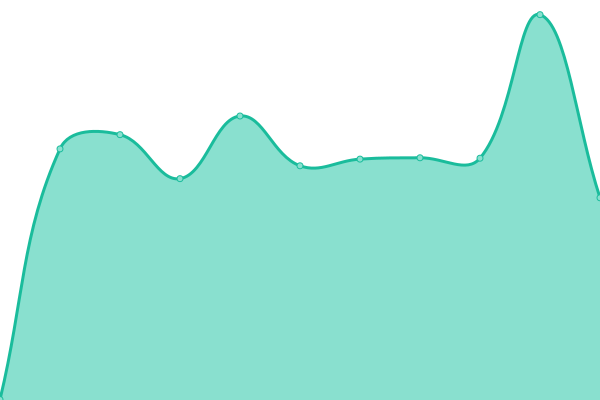
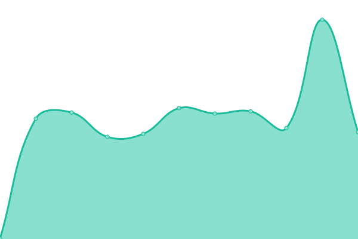
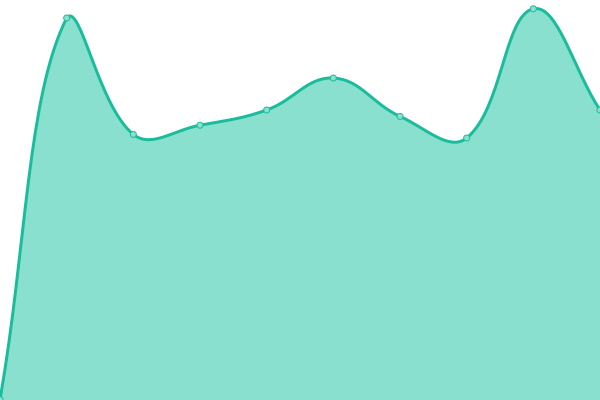

# [📈 Live Status](https://uptime.m17.link): <!--live status--> **🟩 All systems operational**

This repository contains the open-source uptime monitor and status page for [M17 Project](https://m17project.org/), powered by [Upptime](https://github.com/upptime/upptime).

With [Upptime](https://upptime.js.org), you can get your own unlimited and free uptime monitor and status page, powered entirely by a GitHub repository. We use [Issues](https://github.com/M17-Project/upptime/issues) as incident reports, [Actions](https://github.com/M17-Project/upptime/actions) as uptime monitors, and [Pages](https://uptime.m17.link) for the status page.

<!--start: status pages-->
<!-- This summary is generated by Upptime (https://github.com/upptime/upptime) -->
<!-- Do not edit this manually, your changes will be overwritten -->

| URL                                                  | Status | History                                                                                    | Response Time                                                                 | Uptime                                                                                                                                                                                                    |
| ---------------------------------------------------- | ------ | ------------------------------------------------------------------------------------------ | ----------------------------------------------------------------------------- | --------------------------------------------------------------------------------------------------------------------------------------------------------------------------------------------------------- |
| [M17-190](https://m17.argentina-room.dns-cloud.net/) | 🟩 Up  | [m17-190.yml](https://github.com/M17-Project/upptime/commits/master/history/m17-190.yml)   |  985ms  |    |
| [M17-214](https://214.m17.es/)                       | 🟩 Up  | [m17-214.yml](https://github.com/M17-Project/upptime/commits/master/history/m17-214.yml)   |  1884ms |    |
| [M17-224](https://eamaster.xreflector.es/m17/)       | 🟩 Up  | [m17-224.yml](https://github.com/M17-Project/upptime/commits/master/history/m17-224.yml)   |  822ms  |    |
| [M17-ARG](https://m17arg.ddns.net/)                  | 🟩 Up  | [m17-arg.yml](https://github.com/M17-Project/upptime/commits/master/history/m17-arg.yml)   |  807ms  |    |
| [M17-AUT](https://m17-aut.xreflector.net/)           | 🟩 Up  | [m17-aut.yml](https://github.com/M17-Project/upptime/commits/master/history/m17-aut.yml)   |  776ms  |    |
| [M17-BEL](https://on0lg.no-ip.org/m17bel/)           | 🟩 Up  | [m17-bel.yml](https://github.com/M17-Project/upptime/commits/master/history/m17-bel.yml)   |  995ms  |    |
| [M17-DEU](https://m17-deu.xreflector.net/)           | 🟩 Up  | [m17-deu.yml](https://github.com/M17-Project/upptime/commits/master/history/m17-deu.yml)   |  669ms  |    |
| [M17-EA7](https://rcveleta.xreflector.es/)           | 🟩 Up  | [m17-ea-7.yml](https://github.com/M17-Project/upptime/commits/master/history/m17-ea-7.yml) |  795ms |  |
| [M17-ESP](https://m17spa.xreflector.es/)             | 🟩 Up  | [m17-esp.yml](https://github.com/M17-Project/upptime/commits/master/history/m17-esp.yml)   |  825ms  |    |
| [M17-GAX](https://ea4gax.es/M17/)                    | 🟩 Up  | [m17-gax.yml](https://github.com/M17-Project/upptime/commits/master/history/m17-gax.yml)   |  740ms  |    |
| [M17-GBR](https://www.roip.network/m17/)             | 🟩 Up  | [m17-gbr.yml](https://github.com/M17-Project/upptime/commits/master/history/m17-gbr.yml)   |  762ms  |    |
| [M17-ITA](https://m17ita.hblink.it/)                 | 🟩 Up  | [m17-ita.yml](https://github.com/M17-Project/upptime/commits/master/history/m17-ita.yml)   |  799ms  |    |
| [M17-KOR](https://m17-kor.dvham.com/)                | 🟩 Up  | [m17-kor.yml](https://github.com/M17-Project/upptime/commits/master/history/m17-kor.yml)   |  912ms  |    |
| [M17-KP4](https://kp4ca-m17.ddns.net/)               | 🟩 Up  | [m17-kp-4.yml](https://github.com/M17-Project/upptime/commits/master/history/m17-kp-4.yml) |  187ms |  |
| [M17-LAT](https://latinos.m17.es/)                   | 🟩 Up  | [m17-lat.yml](https://github.com/M17-Project/upptime/commits/master/history/m17-lat.yml)   |  432ms  |    |
| [M17-M17](https://ref.m17.link/)                     | 🟩 Up  | [m17-m17.yml](https://github.com/M17-Project/upptime/commits/master/history/m17-m17.yml)   |  184ms  |    |
| [M17-NOR](https://m17.la2k.no/)                      | 🟩 Up  | [m17-nor.yml](https://github.com/M17-Project/upptime/commits/master/history/m17-nor.yml)   |  670ms  |    |
| [M17-POL](https://m17.hblink.network/)               | 🟩 Up  | [m17-pol.yml](https://github.com/M17-Project/upptime/commits/master/history/m17-pol.yml)   |  818ms  |    |
| [M17-POR](https://m17.hamradio.pt/)                  | 🟩 Up  | [m17-por.yml](https://github.com/M17-Project/upptime/commits/master/history/m17-por.yml)   |  903ms  |    |
| [M17-SAL](https://m17sal.m17.es/)                    | 🟩 Up  | [m17-sal.yml](https://github.com/M17-Project/upptime/commits/master/history/m17-sal.yml)   |  727ms  |    |
| [M17-SPA](https://hblinkspain.duckdns.org/mrefd/)    | 🟩 Up  | [m17-spa.yml](https://github.com/M17-Project/upptime/commits/master/history/m17-spa.yml)   |  786ms  |    |
| [M17-URG](https://m17-uruguay.ddns.net/m17/)         | 🟩 Up  | [m17-urg.yml](https://github.com/M17-Project/upptime/commits/master/history/m17-urg.yml)   |  799ms  |    |
| [M17-USA](https://m17-usa.openquad.net/)             | 🟩 Up  | [m17-usa.yml](https://github.com/M17-Project/upptime/commits/master/history/m17-usa.yml)   |  247ms  |    |

<!--end: status pages-->

[**Visit our status website →**](https://uptime.m17.link)

## 📄 License

- Code: [MIT](./LICENSE) © [M17 Project](https://m17project.org)
- Data in the `./history` directory: [Open Database License](https://opendatacommons.org/licenses/odbl/1-0/)
