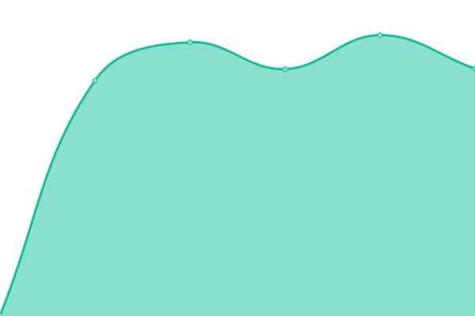
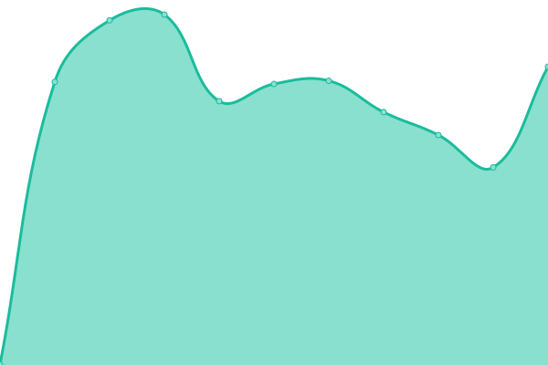
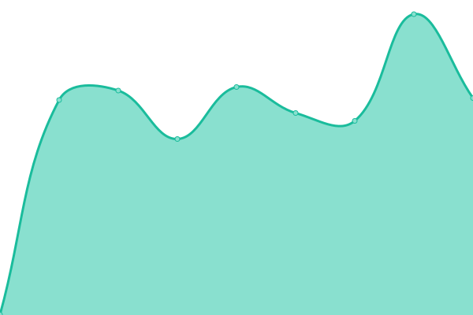

# 

<!--start: description-->

Upptime (https://upptime.js.org) is the open-source uptime monitor and status page, powered entirely by GitHub Actions and Issues.

<!--end: description-->

## [📈 Live Status](https://demo.upptime.js.org): <!--live status--> **🟨 Partial outage**

<!--start: status pages-->
| URL | Status | History | Response Time | Uptime |
| --- | ------ | ------- | ------------- | ------ |
| [M17-190](https://m17.argentina-room.dns-cloud.net/) | 🟩 Up | [m17-190.yml](https://github.com/M17-Project/upptime/commits/master/history/m17-190.yml) |  1872ms | 
| [M17-214](https://214.m17.es/) | 🟩 Up | [m17-214.yml](https://github.com/M17-Project/upptime/commits/master/history/m17-214.yml) |  403ms | 
| [M17-224](https://eamaster.xreflector.es/m17/) | 🟩 Up | [m17-224.yml](https://github.com/M17-Project/upptime/commits/master/history/m17-224.yml) |  892ms | 
| [M17-ARG](https://m17arg.ddns.net/) | 🟩 Up | [m17-arg.yml](https://github.com/M17-Project/upptime/commits/master/history/m17-arg.yml) |  820ms | 
| [M17-AUT](https://m17-aut.xreflector.net/) | 🟩 Up | [m17-aut.yml](https://github.com/M17-Project/upptime/commits/master/history/m17-aut.yml) |  1019ms | 
| [M17-BEL](https://on0lg.no-ip.org/m17bel/) | 🟩 Up | [m17-bel.yml](https://github.com/M17-Project/upptime/commits/master/history/m17-bel.yml) |  704ms | 
| [M17-DEU](https://m17-deu.xreflector.net/) | 🟩 Up | [m17-deu.yml](https://github.com/M17-Project/upptime/commits/master/history/m17-deu.yml) |  710ms | 
| [M17-EA7](https://rcveleta.xreflector.es/) | 🟩 Up | [m17-ea-7.yml](https://github.com/M17-Project/upptime/commits/master/history/m17-ea-7.yml) |  824ms | 
| [M17-ESP](https://m17spa.xreflector.es/) | 🟩 Up | [m17-esp.yml](https://github.com/M17-Project/upptime/commits/master/history/m17-esp.yml) |  1017ms | 
| [M17-GAX](https://ea4gax.es/M17/) | 🟩 Up | [m17-gax.yml](https://github.com/M17-Project/upptime/commits/master/history/m17-gax.yml) |  641ms | 
| [M17-GBR](https://www.roip.network/m17/) | 🟩 Up | [m17-gbr.yml](https://github.com/M17-Project/upptime/commits/master/history/m17-gbr.yml) |  750ms | 
| [M17-ITA](https://m17ita.hblink.it/) | 🟩 Up | [m17-ita.yml](https://github.com/M17-Project/upptime/commits/master/history/m17-ita.yml) |  817ms | 
| [M17-KOR](https://m17-kor.dvham.com/) | 🟥 Down | [m17-kor.yml](https://github.com/M17-Project/upptime/commits/master/history/m17-kor.yml) |  462ms | 
| [M17-KP4](https://kp4ca-m17.ddns.net/) | 🟩 Up | [m17-kp-4.yml](https://github.com/M17-Project/upptime/commits/master/history/m17-kp-4.yml) |  245ms | 
| [M17-LAT](https://latinos.m17.es/) | 🟩 Up | [m17-lat.yml](https://github.com/M17-Project/upptime/commits/master/history/m17-lat.yml) |  930ms | 
| [M17-M17](https://ref.m17.link/) | 🟩 Up | [m17-m17.yml](https://github.com/M17-Project/upptime/commits/master/history/m17-m17.yml) |  184ms | 
| [M17-NOR](https://m17.la2k.no/) | 🟩 Up | [m17-nor.yml](https://github.com/M17-Project/upptime/commits/master/history/m17-nor.yml) |  707ms | 
| [M17-POL](https://m17.hblink.network/) | 🟩 Up | [m17-pol.yml](https://github.com/M17-Project/upptime/commits/master/history/m17-pol.yml) |  965ms | 
| [M17-POR](https://m17.hamradio.pt/) | 🟩 Up | [m17-por.yml](https://github.com/M17-Project/upptime/commits/master/history/m17-por.yml) |  1000ms | 
| [M17-SAL](https://m17sal.m17.es/) | 🟩 Up | [m17-sal.yml](https://github.com/M17-Project/upptime/commits/master/history/m17-sal.yml) |  767ms | 
| [M17-SPA](https://hblinkspain.duckdns.org/mrefd/) | 🟩 Up | [m17-spa.yml](https://github.com/M17-Project/upptime/commits/master/history/m17-spa.yml) |  519ms | 
| [M17-URG](https://m17-uruguay.ddns.net/m17/) | 🟩 Up | [m17-urg.yml](https://github.com/M17-Project/upptime/commits/master/history/m17-urg.yml) |  1092ms | 
| [M17-USA](https://m17-usa.openquad.net/) | 🟩 Up | [m17-usa.yml](https://github.com/M17-Project/upptime/commits/master/history/m17-usa.yml) |  269ms | 
<!--end: status pages-->

<!--start: docs-->

## ⭐ How it works

- GitHub Actions is used as an uptime monitor
  - Every 5 minutes, a workflow visits your website to make sure it's up
  - Response time is recorded every 6 hours and committed to git
  - Graphs of response time are generated every day
- GitHub Issues are used for incident reports
  - An issue is opened if an endpoint is down
  - People from your team are assigned to the issue
  - Incidents reports are posted as issue comments
  - Issues are locked so non-members cannot comment on them
  - Issues are closed automatically when your site comes back up
  - Slack notifications are sent on updates
- GitHub Pages are used for the status website
  - A simple, beautiful, and accessible PWA is generated
  - Built with Svelte and Sapper
  - Fetches data from this repository using the GitHub API

<!--end: docs-->

## 📄 License

- Code: [MIT](./LICENSE) © [M17 Project](https://m17project.org)
- Data in the `./history` directory: [Open Database License](https://opendatacommons.org/licenses/odbl/1-0/)

<!--start: logo-->

  

  An open source project by <a href="https://m17project.org">M17</a>.   <a href="https://m17project.org">M17 - Bleeding Edge Amateur Radio!</a>

<!--end: logo-->
