# [📈 Live Status](https://uptime.m17.link): <!--live status--> **🟧 Partial outage**

This repository contains the open-source uptime monitor and status page for [M17 Project](https://m17project.org/), powered by [Upptime](https://github.com/upptime/upptime).

With [Upptime](https://upptime.js.org), you can get your own unlimited and free uptime monitor and status page, powered entirely by a GitHub repository. We use [Issues](https://github.com/M17-Project/upptime/issues) as incident reports, [Actions](https://github.com/M17-Project/upptime/actions) as uptime monitors, and [Pages](https://uptime.m17.link) for the status page.

<!--start: status pages-->
<!-- This summary is generated by Upptime (https://github.com/upptime/upptime) -->
<!-- Do not edit this manually, your changes will be overwritten -->
<!-- prettier-ignore -->
| URL | Status | History | Response Time | Uptime |
| --- | ------ | ------- | ------------- | ------ |
|  [M17-000](https://m17.cqzone.org) | 🟥 Down | [m17-000.yml](https://github.com/M17-Project/upptime/commits/HEAD/history/m17-000.yml) | 

 0ms
     
 | 

<a href="https://uptime.m17.link/history/m17-000">0.00%</a>
    

|  [M17-020](https://m17-020.k2ie.net) | 🟩 Up | [m17-020.yml](https://github.com/M17-Project/upptime/commits/HEAD/history/m17-020.yml) | 

 238ms
     
 | 

<a href="https://uptime.m17.link/history/m17-020">100.00%</a>
    

|  [M17-033](https://m17-033.dyndns.org) | 🟩 Up | [m17-033.yml](https://github.com/M17-Project/upptime/commits/HEAD/history/m17-033.yml) | 

 743ms
     
 | 

<a href="https://uptime.m17.link/history/m17-033">100.00%</a>
    

|  [M17-100](https://hellaszone.com/m17/) | 🟥 Down | [m17-100.yml](https://github.com/M17-Project/upptime/commits/HEAD/history/m17-100.yml) | 

 0ms
     
 | 

<a href="https://uptime.m17.link/history/m17-100">0.00%</a>
    

|  [M17-138](https://m17138.freeddns.org) | 🟩 Up | [m17-138.yml](https://github.com/M17-Project/upptime/commits/HEAD/history/m17-138.yml) | 

 1108ms
     
 | 

<a href="https://uptime.m17.link/history/m17-138">100.00%</a>
    

|  [M17-148](https://m17.hs3tdi.com/) | 🟩 Up | [m17-148.yml](https://github.com/M17-Project/upptime/commits/HEAD/history/m17-148.yml) | 

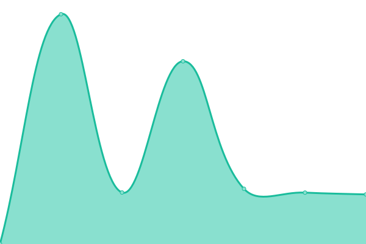 1989ms
     
 | 

<a href="https://uptime.m17.link/history/m17-148">100.00%</a>
    

|  [M17-149](https://m17.pwk.ac.th/) | 🟩 Up | [m17-149.yml](https://github.com/M17-Project/upptime/commits/HEAD/history/m17-149.yml) | 

 1392ms
     
 | 

<a href="https://uptime.m17.link/history/m17-149">99.79%</a>
    

|  [M17-190](https://m17.argentina.net) | 🟥 Down | [m17-190.yml](https://github.com/M17-Project/upptime/commits/HEAD/history/m17-190.yml) | 

 0ms
     
 | 

<a href="https://uptime.m17.link/history/m17-190">0.00%</a>
    

|  [M17-201](https://m17.xlx201.uk) | 🟩 Up | [m17-201.yml](https://github.com/M17-Project/upptime/commits/HEAD/history/m17-201.yml) | 

 360ms
     
 | 

<a href="https://uptime.m17.link/history/m17-201">100.00%</a>
    

|  [M17-202](https://xlxzone.com/m17) | 🟩 Up | [m17-202.yml](https://github.com/M17-Project/upptime/commits/HEAD/history/m17-202.yml) | 

 772ms
     
 | 

<a href="https://uptime.m17.link/history/m17-202">100.00%</a>
    

|  [M17-216](https://xlx216.km8v.com/m17) | 🟩 Up | [m17-216.yml](https://github.com/M17-Project/upptime/commits/HEAD/history/m17-216.yml) | 

 265ms
     
 | 

<a href="https://uptime.m17.link/history/m17-216">100.00%</a>
    

|  [M17-239](https://m17.ac8zd.com) | 🟩 Up | [m17-239.yml](https://github.com/M17-Project/upptime/commits/HEAD/history/m17-239.yml) | 

 178ms
     
 | 

<a href="https://uptime.m17.link/history/m17-239">99.57%</a>
    

|  [M17-245](https://m17245.ddns.net) | 🟥 Down | [m17-245.yml](https://github.com/M17-Project/upptime/commits/HEAD/history/m17-245.yml) | 

 0ms
     
 | 

<a href="https://uptime.m17.link/history/m17-245">0.00%</a>
    

|  [M17-386](https://m17.foxhole.radio) | 🟩 Up | [m17-386.yml](https://github.com/M17-Project/upptime/commits/HEAD/history/m17-386.yml) | 

 516ms
     
 | 

<a href="https://uptime.m17.link/history/m17-386">98.62%</a>
    

|  [M17-432](https://m17.vkradio.com) | 🟩 Up | [m17-432.yml](https://github.com/M17-Project/upptime/commits/HEAD/history/m17-432.yml) | 

 731ms
     
 | 

<a href="https://uptime.m17.link/history/m17-432">99.77%</a>
    

|  [M17-621](https://urf.hrcc.link) | 🟩 Up | [m17-621.yml](https://github.com/M17-Project/upptime/commits/HEAD/history/m17-621.yml) | 

 857ms
     
 | 

<a href="https://uptime.m17.link/history/m17-621">100.00%</a>
    

|  [M17-659](https://m17.af0ss.org) | 🟥 Down | [m17-659.yml](https://github.com/M17-Project/upptime/commits/HEAD/history/m17-659.yml) | 

 0ms
     
 | 

<a href="https://uptime.m17.link/history/m17-659">0.00%</a>
    

|  [M17-672](https://xlx672-dash.pistar.uk/) | 🟩 Up | [m17-672.yml](https://github.com/M17-Project/upptime/commits/HEAD/history/m17-672.yml) | 

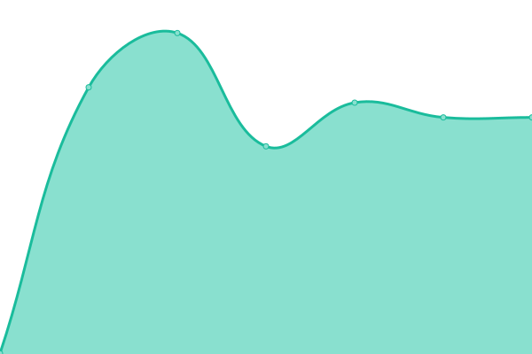 302ms
     
 | 

<a href="https://uptime.m17.link/history/m17-672">100.00%</a>
    

|  [M17-714](https://m17.ea3hkb.cat) | 🟥 Down | [m17-714.yml](https://github.com/M17-Project/upptime/commits/HEAD/history/m17-714.yml) | 

 0ms
     
 | 

<a href="https://uptime.m17.link/history/m17-714">0.00%</a>
    

|  [M17-724](https://m17724.dvbr.net) | 🟩 Up | [m17-724.yml](https://github.com/M17-Project/upptime/commits/HEAD/history/m17-724.yml) | 

 733ms
     
 | 

<a href="https://uptime.m17.link/history/m17-724">98.31%</a>
    

|  [M17-727](https://m17-727.ddns.net) | 🟩 Up | [m17-727.yml](https://github.com/M17-Project/upptime/commits/HEAD/history/m17-727.yml) | 

 844ms
     
 | 

<a href="https://uptime.m17.link/history/m17-727">99.74%</a>
    

|  [M17-734](https://urf734.dgtlcom.net) | 🟩 Up | [m17-734.yml](https://github.com/M17-Project/upptime/commits/HEAD/history/m17-734.yml) | 

 836ms
     
 | 

<a href="https://uptime.m17.link/history/m17-734">97.78%</a>
    

|  [M17-765](https://ik1-342-31132.vs.sakura.ne.jp/~ham/m17/) | 🟩 Up | [m17-765.yml](https://github.com/M17-Project/upptime/commits/HEAD/history/m17-765.yml) | 

 1000ms
     
 | 

<a href="https://uptime.m17.link/history/m17-765">99.81%</a>
    

|  [M17-815](https://m17.we0fun.com) | 🟩 Up | [m17-815.yml](https://github.com/M17-Project/upptime/commits/HEAD/history/m17-815.yml) | 

 500ms
     
 | 

<a href="https://uptime.m17.link/history/m17-815">97.94%</a>
    

|  [M17-818](https://m17.hamnew.com) | 🟩 Up | [m17-818.yml](https://github.com/M17-Project/upptime/commits/HEAD/history/m17-818.yml) | 

 1073ms
     
 | 

<a href="https://uptime.m17.link/history/m17-818">99.74%</a>
    

|  [M17-910](https://m17.mywire.org) | 🟥 Down | [m17-910.yml](https://github.com/M17-Project/upptime/commits/HEAD/history/m17-910.yml) | 

 415ms
     
 | 

<a href="https://uptime.m17.link/history/m17-910">13.78%</a>
    

|  [M17-911](https://911m17.freeddns.org) | 🟩 Up | [m17-911.yml](https://github.com/M17-Project/upptime/commits/HEAD/history/m17-911.yml) | 

 1048ms
     
 | 

<a href="https://uptime.m17.link/history/m17-911">99.74%</a>
    

|  [M17-948](https://m17icq.icqpodcast.com) | 🟥 Down | [m17-948.yml](https://github.com/M17-Project/upptime/commits/HEAD/history/m17-948.yml) | 

 0ms
     
 | 

<a href="https://uptime.m17.link/history/m17-948">0.00%</a>
    

|  [M17-983](https://M17-983.k8jtk.org/) | 🟩 Up | [m17-983.yml](https://github.com/M17-Project/upptime/commits/HEAD/history/m17-983.yml) | 

 294ms
     
 | 

<a href="https://uptime.m17.link/history/m17-983">99.74%</a>
    

|  [M17-999](https://m17-999.duckdns.org) | 🟥 Down | [m17-999.yml](https://github.com/M17-Project/upptime/commits/HEAD/history/m17-999.yml) | 

 0ms
     
 | 

<a href="https://uptime.m17.link/history/m17-999">0.00%</a>
    

|  [M17-AFG](https://m17.amateurfunk.uni-kl.de) | 🟩 Up | [m17-afg.yml](https://github.com/M17-Project/upptime/commits/HEAD/history/m17-afg.yml) | 

 2921ms
     
 | 

<a href="https://uptime.m17.link/history/m17-afg">99.54%</a>
    

|  [M17-AND](https://m17and.xreflector.es/m17) | 🟩 Up | [m17-and.yml](https://github.com/M17-Project/upptime/commits/HEAD/history/m17-and.yml) | 

 517ms
     
 | 

<a href="https://uptime.m17.link/history/m17-and">0.00%</a>
    

|  [M17-ARC](https://m17.ddns.net/m17/index.php) | 🟥 Down | [m17-arc.yml](https://github.com/M17-Project/upptime/commits/HEAD/history/m17-arc.yml) | 

 0ms
     
 | 

<a href="https://uptime.m17.link/history/m17-arc">0.00%</a>
    

|  [M17-ASL](https://51593.it/m17) | 🟩 Up | [m17-asl.yml](https://github.com/M17-Project/upptime/commits/HEAD/history/m17-asl.yml) | 

 4572ms
     
 | 

<a href="https://uptime.m17.link/history/m17-asl">100.00%</a>
    

|  [M17-AUT](https://m17-aut.xreflector.net/) | 🟩 Up | [m17-aut.yml](https://github.com/M17-Project/upptime/commits/HEAD/history/m17-aut.yml) | 

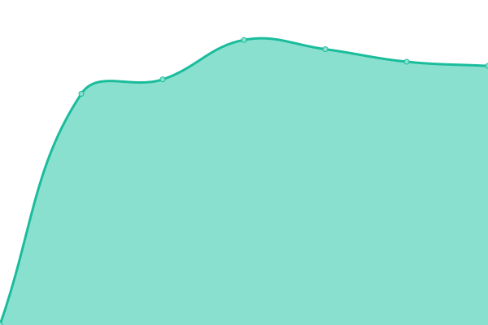 591ms
     
 | 

<a href="https://uptime.m17.link/history/m17-aut">100.00%</a>
    

|  [M17-BEL](https://freedmr.be/m17bel) | 🟥 Down | [m17-bel.yml](https://github.com/M17-Project/upptime/commits/HEAD/history/m17-bel.yml) | 

 0ms
     
 | 

<a href="https://uptime.m17.link/history/m17-bel">0.00%</a>
    

|  [M17-BRA](https://m17bra.net) | 🟩 Up | [m17-bra.yml](https://github.com/M17-Project/upptime/commits/HEAD/history/m17-bra.yml) | 

 501ms
     
 | 

<a href="https://uptime.m17.link/history/m17-bra">98.56%</a>
    

|  [M17-CAD](http://ontxlink.hopto.org/m17/index.php) | 🟩 Up | [m17-cad.yml](https://github.com/M17-Project/upptime/commits/HEAD/history/m17-cad.yml) | 

 198ms
     
 | 

<a href="https://uptime.m17.link/history/m17-cad">90.63%</a>
    

|  [M17-CAS](https://castellar.m17.es/m17/) | 🟥 Down | [m17-cas.yml](https://github.com/M17-Project/upptime/commits/HEAD/history/m17-cas.yml) | 

 0ms
     
 | 

<a href="https://uptime.m17.link/history/m17-cas">0.00%</a>
    

|  [M17-CAT](https://m17catalonia.ddns.net/) | 🟥 Down | [m17-cat.yml](https://github.com/M17-Project/upptime/commits/HEAD/history/m17-cat.yml) | 

 0ms
     
 | 

<a href="https://uptime.m17.link/history/m17-cat">0.00%</a>
    

|  [M17-CCV](https://m17.owari.biz/ref-dash) | 🟩 Up | [m17-ccv.yml](https://github.com/M17-Project/upptime/commits/HEAD/history/m17-ccv.yml) | 

 5256ms
     
 | 

<a href="https://uptime.m17.link/history/m17-ccv">99.73%</a>
    

|  [M17-CHI](https://m17ch-italia.ddns.net/) | 🟥 Down | [m17-chi.yml](https://github.com/M17-Project/upptime/commits/HEAD/history/m17-chi.yml) | 

 0ms
     
 | 

<a href="https://uptime.m17.link/history/m17-chi">0.00%</a>
    

|  [M17-CL1](https://m17.radioaficion.pro/) | 🟩 Up | [m17-cl-1.yml](https://github.com/M17-Project/upptime/commits/HEAD/history/m17-cl-1.yml) | 

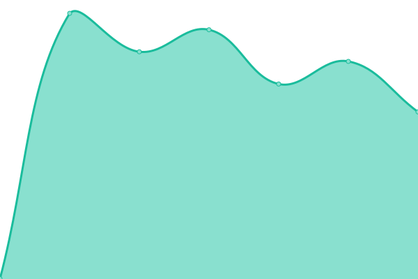 680ms
     
 | 

<a href="https://uptime.m17.link/history/m17-cl-1">100.00%</a>
    

|  [M17-CLB](https://m17.club) | 🟩 Up | [m17-clb.yml](https://github.com/M17-Project/upptime/commits/HEAD/history/m17-clb.yml) | 

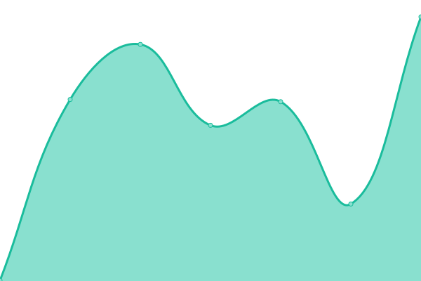 344ms
     
 | 

<a href="https://uptime.m17.link/history/m17-clb">100.00%</a>
    

|  [M17-COR](HTTP://m17.radioamateur.tk) | 🟩 Up | [m17-cor.yml](https://github.com/M17-Project/upptime/commits/HEAD/history/m17-cor.yml) | 

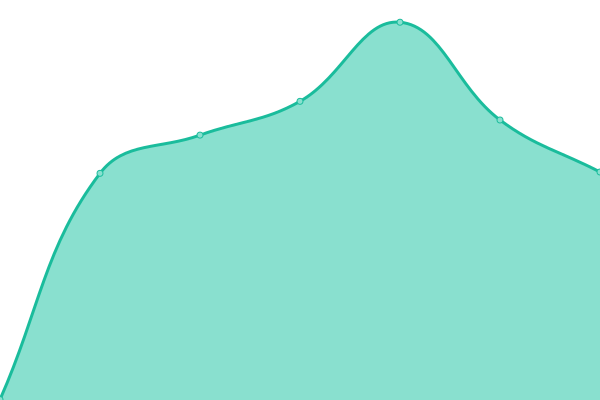 1248ms
     
 | 

<a href="https://uptime.m17.link/history/m17-cor">99.82%</a>
    

|  [M17-D22](https://dc7jzb.de/M17Dash) | 🟩 Up | [m17-d22.yml](https://github.com/M17-Project/upptime/commits/HEAD/history/m17-d22.yml) | 

 1556ms
     
 | 

<a href="https://uptime.m17.link/history/m17-d22">99.07%</a>
    

|  [M17-DEU](https://m17-deu.xreflector.net/) | 🟩 Up | [m17-deu.yml](https://github.com/M17-Project/upptime/commits/HEAD/history/m17-deu.yml) | 

 452ms
     
 | 

<a href="https://uptime.m17.link/history/m17-deu">100.00%</a>
    

|  [M17-DEV](https://tarxvf.tech/) | 🟩 Up | [m17-dev.yml](https://github.com/M17-Project/upptime/commits/HEAD/history/m17-dev.yml) | 

 264ms
     
 | 

<a href="https://uptime.m17.link/history/m17-dev">100.00%</a>
    

|  [M17-DGN](Http://famiuse.ddns.net:2015) | 🟩 Up | [m17-dgn.yml](https://github.com/M17-Project/upptime/commits/HEAD/history/m17-dgn.yml) | 

 625ms
     
 | 

<a href="https://uptime.m17.link/history/m17-dgn">100.00%</a>
    

|  [M17-DMR](https://m17.freestar.network) | 🟩 Up | [m17-dmr.yml](https://github.com/M17-Project/upptime/commits/HEAD/history/m17-dmr.yml) | 

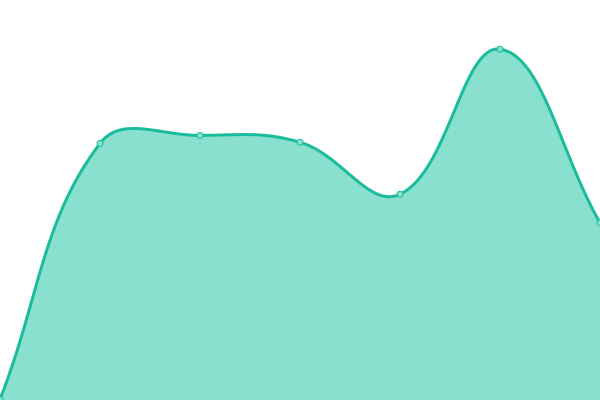 558ms
     
 | 

<a href="https://uptime.m17.link/history/m17-dmr">86.45%</a>
    

|  [M17-EA1](https://eadistrito1.m17.es/m17/) | 🟩 Up | [m17-ea-1.yml](https://github.com/M17-Project/upptime/commits/HEAD/history/m17-ea-1.yml) | 

 688ms
     
 | 

<a href="https://uptime.m17.link/history/m17-ea-1">100.00%</a>
    

|  [M17-EA8](https://ea8ee.m17.es/m17/) | 🟥 Down | [m17-ea-8.yml](https://github.com/M17-Project/upptime/commits/HEAD/history/m17-ea-8.yml) | 

 0ms
     
 | 

<a href="https://uptime.m17.link/history/m17-ea-8">0.00%</a>
    

|  [M17-ECR](https://ko4uyj.com) | 🟩 Up | [m17-ecr.yml](https://github.com/M17-Project/upptime/commits/HEAD/history/m17-ecr.yml) | 

 271ms
     
 | 

<a href="https://uptime.m17.link/history/m17-ecr">100.00%</a>
    

|  [M17-ESP](https://m17spa.xreflector.es/) | 🟩 Up | [m17-esp.yml](https://github.com/M17-Project/upptime/commits/HEAD/history/m17-esp.yml) | 

 997ms
     
 | 

<a href="https://uptime.m17.link/history/m17-esp">100.00%</a>
    

|  [M17-FIN](https://openvpn.fi/M17/) | 🟥 Down | [m17-fin.yml](https://github.com/M17-Project/upptime/commits/HEAD/history/m17-fin.yml) | 

 0ms
     
 | 

<a href="https://uptime.m17.link/history/m17-fin">0.00%</a>
    

|  [M17-FOG](https://m17.ham-radio-fog.org/) | 🟩 Up | [m17-fog.yml](https://github.com/M17-Project/upptime/commits/HEAD/history/m17-fog.yml) | 

 445ms
     
 | 

<a href="https://uptime.m17.link/history/m17-fog">99.82%</a>
    

|  [M17-FRA](https://m17-fra.f5dan.fr) | 🟩 Up | [m17-fra.yml](https://github.com/M17-Project/upptime/commits/HEAD/history/m17-fra.yml) | 

 754ms
     
 | 

<a href="https://uptime.m17.link/history/m17-fra">99.46%</a>
    

|  [M17-FRH](https://m17.f4htn.fr) | 🟥 Down | [m17-frh.yml](https://github.com/M17-Project/upptime/commits/HEAD/history/m17-frh.yml) | 

 0ms
     
 | 

<a href="https://uptime.m17.link/history/m17-frh">0.00%</a>
    

|  [M17-FRN](https://m17krotonfrn.ddns.net) | 🟥 Down | [m17-frn.yml](https://github.com/M17-Project/upptime/commits/HEAD/history/m17-frn.yml) | 

 0ms
     
 | 

<a href="https://uptime.m17.link/history/m17-frn">0.00%</a>
    

|  [M17-FUR](https://ord1.w3fur.radio:17000) | 🟥 Down | [m17-fur.yml](https://github.com/M17-Project/upptime/commits/HEAD/history/m17-fur.yml) | 

 4163ms
     
 | 

<a href="https://uptime.m17.link/history/m17-fur">44.72%</a>
    

|  [M17-FVG](https://m17fvg.hblink.it) | 🟩 Up | [m17-fvg.yml](https://github.com/M17-Project/upptime/commits/HEAD/history/m17-fvg.yml) | 

 745ms
     
 | 

<a href="https://uptime.m17.link/history/m17-fvg">100.00%</a>
    

|  [M17-GAX](https://ea4gax.es/M17/) | 🟩 Up | [m17-gax.yml](https://github.com/M17-Project/upptime/commits/HEAD/history/m17-gax.yml) | 

 611ms
     
 | 

<a href="https://uptime.m17.link/history/m17-gax">100.00%</a>
    

|  [M17-GSP](https://xlxsof.ddns.net:17001) | 🟥 Down | [m17-gsp.yml](https://github.com/M17-Project/upptime/commits/HEAD/history/m17-gsp.yml) | 

 0ms
     
 | 

<a href="https://uptime.m17.link/history/m17-gsp">0.00%</a>
    

|  [M17-HAM](https://m17-ham.ddns.net/) | 🟩 Up | [m17-ham.yml](https://github.com/M17-Project/upptime/commits/HEAD/history/m17-ham.yml) | 

 185ms
     
 | 

<a href="https://uptime.m17.link/history/m17-ham">100.00%</a>
    

|  [M17-HRV](https://m17.hamvillage.org) | 🟩 Up | [m17-hrv.yml](https://github.com/M17-Project/upptime/commits/HEAD/history/m17-hrv.yml) | 

 332ms
     
 | 

<a href="https://uptime.m17.link/history/m17-hrv">100.00%</a>
    

|  [M17-HUB](https://g7rpg.hubnetwork.uk/m17) | 🟥 Down | [m17-hub.yml](https://github.com/M17-Project/upptime/commits/HEAD/history/m17-hub.yml) | 

 467ms
     
 | 

<a href="https://uptime.m17.link/history/m17-hub">0.00%</a>
    

|  [M17-HWN](https://m17.memhamwan.net/) | 🟥 Down | [m17-hwn.yml](https://github.com/M17-Project/upptime/commits/HEAD/history/m17-hwn.yml) | 

 587ms
     
 | 

<a href="https://uptime.m17.link/history/m17-hwn">0.00%</a>
    

|  [M17-IND](https://ysf-india.ddns.net/) | 🟥 Down | [m17-ind.yml](https://github.com/M17-Project/upptime/commits/HEAD/history/m17-ind.yml) | 

 0ms
     
 | 

<a href="https://uptime.m17.link/history/m17-ind">0.00%</a>
    

|  [M17-IRN](https://m17.irn.radio) | 🟥 Down | [m17-irn.yml](https://github.com/M17-Project/upptime/commits/HEAD/history/m17-irn.yml) | 

 0ms
     
 | 

<a href="https://uptime.m17.link/history/m17-irn">0.00%</a>
    

|  [M17-IS0](https://m17.is0.org/) | 🟩 Up | [m17-is-0.yml](https://github.com/M17-Project/upptime/commits/HEAD/history/m17-is-0.yml) | 

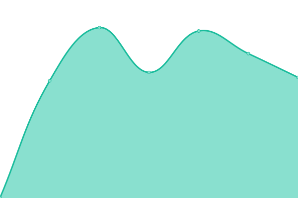 1068ms
     
 | 

<a href="https://uptime.m17.link/history/m17-is-0">100.00%</a>
    

|  [M17-ITA](https://m17ita.hblink.it) | 🟩 Up | [m17-ita.yml](https://github.com/M17-Project/upptime/commits/HEAD/history/m17-ita.yml) | 

 640ms
     
 | 

<a href="https://uptime.m17.link/history/m17-ita">100.00%</a>
    

|  [M17-ITD](https://m17.itdmr.it) | 🟥 Down | [m17-itd.yml](https://github.com/M17-Project/upptime/commits/HEAD/history/m17-itd.yml) | 

 0ms
     
 | 

<a href="https://uptime.m17.link/history/m17-itd">0.00%</a>
    

|  [M17-JP1](https://m17.jh1blt.net/m17/) | 🟥 Down | [m17-jp-1.yml](https://github.com/M17-Project/upptime/commits/HEAD/history/m17-jp-1.yml) | 

 0ms
     
 | 

<a href="https://uptime.m17.link/history/m17-jp-1">0.00%</a>
    

|  [M17-JPN](https://m17.f5.si/) | 🟥 Down | [m17-jpn.yml](https://github.com/M17-Project/upptime/commits/HEAD/history/m17-jpn.yml) | 

 0ms
     
 | 

<a href="https://uptime.m17.link/history/m17-jpn">0.00%</a>
    

|  [M17-JWG](https://m17.jwgtechs.com) | 🟩 Up | [m17-jwg.yml](https://github.com/M17-Project/upptime/commits/HEAD/history/m17-jwg.yml) | 

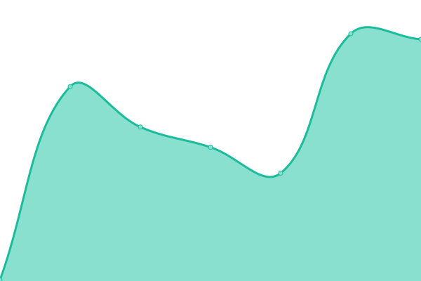 176ms
     
 | 

<a href="https://uptime.m17.link/history/m17-jwg">54.38%</a>
    

|  [M17-KPH](https://m17.kapihan.net) | 🟥 Down | [m17-kph.yml](https://github.com/M17-Project/upptime/commits/HEAD/history/m17-kph.yml) | 

 0ms
     
 | 

<a href="https://uptime.m17.link/history/m17-kph">0.00%</a>
    

|  [M17-KR1](https://m17-kr1.kardca.or.kr/) | 🟥 Down | [m17-kr-1.yml](https://github.com/M17-Project/upptime/commits/HEAD/history/m17-kr-1.yml) | 

 0ms
     
 | 

<a href="https://uptime.m17.link/history/m17-kr-1">0.00%</a>
    

|  [M17-KRG](https://n9krgm17.ddns.net) | 🟥 Down | [m17-krg.yml](https://github.com/M17-Project/upptime/commits/HEAD/history/m17-krg.yml) | 

 0ms
     
 | 

<a href="https://uptime.m17.link/history/m17-krg">0.00%</a>
    

|  [M17-LAT](https://latinos.m17.es/m17/) | 🟩 Up | [m17-lat.yml](https://github.com/M17-Project/upptime/commits/HEAD/history/m17-lat.yml) | 

 581ms
     
 | 

<a href="https://uptime.m17.link/history/m17-lat">100.00%</a>
    

|  [M17-LEF](https://xlxlef-dash.gb7hh.co.uk) | 🟩 Up | [m17-lef.yml](https://github.com/M17-Project/upptime/commits/HEAD/history/m17-lef.yml) | 

 387ms
     
 | 

<a href="https://uptime.m17.link/history/m17-lef">100.00%</a>
    

|  [M17-M17](https://ref.m17.link) | 🟩 Up | [m17-m17.yml](https://github.com/M17-Project/upptime/commits/HEAD/history/m17-m17.yml) | 

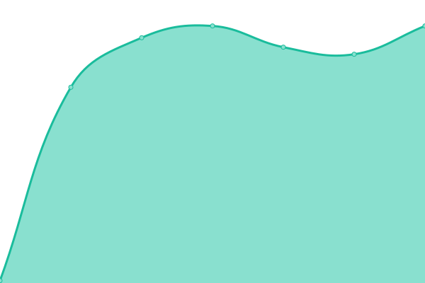 184ms
     
 | 

<a href="https://uptime.m17.link/history/m17-m17">100.00%</a>
    

|  [M17-MGB](https://mgbrasil.duckdns.org:8023/m17) | 🟥 Down | [m17-mgb.yml](https://github.com/M17-Project/upptime/commits/HEAD/history/m17-mgb.yml) | 

 910ms
     
 | 

<a href="https://uptime.m17.link/history/m17-mgb">0.00%</a>
    

|  [M17-NOR](https://m17.la2k.no) | 🟩 Up | [m17-nor.yml](https://github.com/M17-Project/upptime/commits/HEAD/history/m17-nor.yml) | 

 627ms
     
 | 

<a href="https://uptime.m17.link/history/m17-nor">54.39%</a>
    

|  [M17-NWR](https://m17.nwrg.org.uk) | 🟩 Up | [m17-nwr.yml](https://github.com/M17-Project/upptime/commits/HEAD/history/m17-nwr.yml) | 

 493ms
     
 | 

<a href="https://uptime.m17.link/history/m17-nwr">99.81%</a>
    

|  [M17-NZD](https://m17-nzd.m1m0n.net) | 🟩 Up | [m17-nzd.yml](https://github.com/M17-Project/upptime/commits/HEAD/history/m17-nzd.yml) | 

 1468ms
     
 | 

<a href="https://uptime.m17.link/history/m17-nzd">99.48%</a>
    

|  [M17-OFW](https://ofwham.duckdns.org/index.php) | 🟥 Down | [m17-ofw.yml](https://github.com/M17-Project/upptime/commits/HEAD/history/m17-ofw.yml) | 

 0ms
     
 | 

<a href="https://uptime.m17.link/history/m17-ofw">0.00%</a>
    

|  [M17-OH6](https://m17oh6.ddns.net/) | 🟥 Down | [m17-oh-6.yml](https://github.com/M17-Project/upptime/commits/HEAD/history/m17-oh-6.yml) | 

 0ms
     
 | 

<a href="https://uptime.m17.link/history/m17-oh-6">0.00%</a>
    

|  [M17-OKL](https://www.oklahomalink.rcwa.org/m17ref/) | 🟥 Down | [m17-okl.yml](https://github.com/M17-Project/upptime/commits/HEAD/history/m17-okl.yml) | 

 0ms
     
 | 

<a href="https://uptime.m17.link/history/m17-okl">0.00%</a>
    

|  [M17-OMO](https://hub.kimberlychase.com/m17) | 🟩 Up | [m17-omo.yml](https://github.com/M17-Project/upptime/commits/HEAD/history/m17-omo.yml) | 

 311ms
     
 | 

<a href="https://uptime.m17.link/history/m17-omo">53.60%</a>
    

|  [M17-OWL](https://xlx508.hb9gfx.ch/M17-Reflector-Dashboard/index.php) | 🟩 Up | [m17-owl.yml](https://github.com/M17-Project/upptime/commits/HEAD/history/m17-owl.yml) | 

 490ms
     
 | 

<a href="https://uptime.m17.link/history/m17-owl">60.23%</a>
    

|  [M17-OZD](https://dmr.oz-dmr.uk/m17) | 🟥 Down | [m17-ozd.yml](https://github.com/M17-Project/upptime/commits/HEAD/history/m17-ozd.yml) | 

 0ms
     
 | 

<a href="https://uptime.m17.link/history/m17-ozd">0.00%</a>
    

|  [M17-PEG](https://dmr.projekt-pegasus.net/m17/) | 🟩 Up | [m17-peg.yml](https://github.com/M17-Project/upptime/commits/HEAD/history/m17-peg.yml) | 

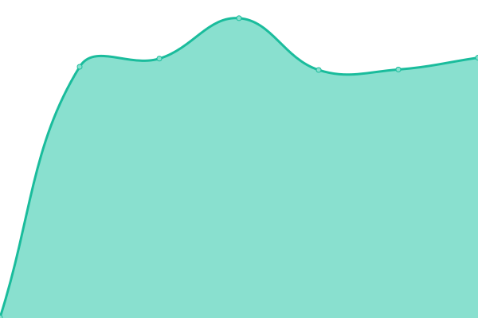 569ms
     
 | 

<a href="https://uptime.m17.link/history/m17-peg">99.70%</a>
    

|  [M17-PER](https://m17.dmr-peru.net) | 🟩 Up | [m17-per.yml](https://github.com/M17-Project/upptime/commits/HEAD/history/m17-per.yml) | 

 586ms
     
 | 

<a href="https://uptime.m17.link/history/m17-per">99.76%</a>
    

|  [M17-PHP](https://dx8wmg-m17.ddns.net/) | 🟩 Up | [m17-php.yml](https://github.com/M17-Project/upptime/commits/HEAD/history/m17-php.yml) | 

 181ms
     
 | 

<a href="https://uptime.m17.link/history/m17-php">69.37%</a>
    

|  [M17-PLG](https://xrf245.pennlinkgroup.com/mrefd/) | 🟩 Up | [m17-plg.yml](https://github.com/M17-Project/upptime/commits/HEAD/history/m17-plg.yml) | 

 174ms
     
 | 

<a href="https://uptime.m17.link/history/m17-plg">53.74%</a>
    

|  [M17-POL](https://m17.hblink.network/) | 🟩 Up | [m17-pol.yml](https://github.com/M17-Project/upptime/commits/HEAD/history/m17-pol.yml) | 

 685ms
     
 | 

<a href="https://uptime.m17.link/history/m17-pol">100.00%</a>
    

|  [M17-POR](https://m17.hamradio.pt/) | 🟩 Up | [m17-por.yml](https://github.com/M17-Project/upptime/commits/HEAD/history/m17-por.yml) | 

 758ms
     
 | 

<a href="https://uptime.m17.link/history/m17-por">100.00%</a>
    

|  [M17-QSO](https://tarxvf.tech) | 🟩 Up | [m17-qso.yml](https://github.com/M17-Project/upptime/commits/HEAD/history/m17-qso.yml) | 

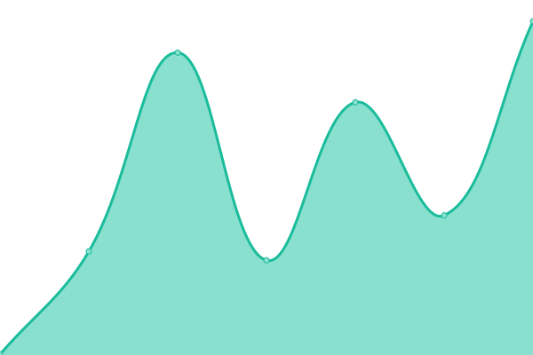 294ms
     
 | 

<a href="https://uptime.m17.link/history/m17-qso">100.00%</a>
    

|  [M17-QUE](https://m17-que.ddns.net) | 🟩 Up | [m17-que.yml](https://github.com/M17-Project/upptime/commits/HEAD/history/m17-que.yml) | 

 235ms
     
 | 

<a href="https://uptime.m17.link/history/m17-que">100.00%</a>
    

|  [M17-ROM](https://tetra-romania.ddns.net/m17/) | 🟩 Up | [m17-rom.yml](https://github.com/M17-Project/upptime/commits/HEAD/history/m17-rom.yml) | 

 493ms
     
 | 

<a href="https://uptime.m17.link/history/m17-rom">100.00%</a>
    

|  [M17-RTX](https://m17.openrtx.org) | 🟩 Up | [m17-rtx.yml](https://github.com/M17-Project/upptime/commits/HEAD/history/m17-rtx.yml) | 

 494ms
     
 | 

<a href="https://uptime.m17.link/history/m17-rtx">100.00%</a>
    

|  [M17-SCS](https://m17-scarsvoip.com/) | 🟩 Up | [m17-scs.yml](https://github.com/M17-Project/upptime/commits/HEAD/history/m17-scs.yml) | 

 253ms
     
 | 

<a href="https://uptime.m17.link/history/m17-scs">99.76%</a>
    

|  [M17-SEL](https://selink.lmarc.net/m17dash) | 🟩 Up | [m17-sel.yml](https://github.com/M17-Project/upptime/commits/HEAD/history/m17-sel.yml) | 

 202ms
     
 | 

<a href="https://uptime.m17.link/history/m17-sel">100.00%</a>
    

|  [M17-SKY](https://m17.skyhublink.com) | 🟩 Up | [m17-sky.yml](https://github.com/M17-Project/upptime/commits/HEAD/history/m17-sky.yml) | 

 242ms
     
 | 

<a href="https://uptime.m17.link/history/m17-sky">99.85%</a>
    

|  [M17-SPA](https://hblinkspain.duckdns.org/mrefd/) | 🟩 Up | [m17-spa.yml](https://github.com/M17-Project/upptime/commits/HEAD/history/m17-spa.yml) | 

 1837ms
     
 | 

<a href="https://uptime.m17.link/history/m17-spa">99.36%</a>
    

|  [M17-SUN](https://kc5fm.ddns.net/m17ref/) | 🟥 Down | [m17-sun.yml](https://github.com/M17-Project/upptime/commits/HEAD/history/m17-sun.yml) | 

 0ms
     
 | 

<a href="https://uptime.m17.link/history/m17-sun">0.00%</a>
    

|  [M17-SWD](https://m17-ref2-swdg.net/) | 🟩 Up | [m17-swd.yml](https://github.com/M17-Project/upptime/commits/HEAD/history/m17-swd.yml) | 

 415ms
     
 | 

<a href="https://uptime.m17.link/history/m17-swd">99.65%</a>
    

|  [M17-TAR](https://tarxvf.tech) | 🟩 Up | [m17-tar.yml](https://github.com/M17-Project/upptime/commits/HEAD/history/m17-tar.yml) | 

 140ms
     
 | 

<a href="https://uptime.m17.link/history/m17-tar">100.00%</a>
    

|  [M17-THA](https://m17.dprns.com) | 🟩 Up | [m17-tha.yml](https://github.com/M17-Project/upptime/commits/HEAD/history/m17-tha.yml) | 

 1516ms
     
 | 

<a href="https://uptime.m17.link/history/m17-tha">90.57%</a>
    

|  [M17-TKO](https://ah-huh.net/m17/) | 🟩 Up | [m17-tko.yml](https://github.com/M17-Project/upptime/commits/HEAD/history/m17-tko.yml) | 

 643ms
     
 | 

<a href="https://uptime.m17.link/history/m17-tko">100.00%</a>
    

|  [M17-UK1](https://2e0lxy.uk/m17) | 🟥 Down | [m17-uk-1.yml](https://github.com/M17-Project/upptime/commits/HEAD/history/m17-uk-1.yml) | 

 0ms
     
 | 

<a href="https://uptime.m17.link/history/m17-uk-1">0.00%</a>
    

|  [M17-URG](https://m17uru.c4fm.es/) | 🟩 Up | [m17-urg.yml](https://github.com/M17-Project/upptime/commits/HEAD/history/m17-urg.yml) | 

 309ms
     
 | 

<a href="https://uptime.m17.link/history/m17-urg">100.00%</a>
    

|  [M17-URU](https://m17uru.c4fm.es/) | 🟩 Up | [m17-uru.yml](https://github.com/M17-Project/upptime/commits/HEAD/history/m17-uru.yml) | 

 41ms
     
 | 

<a href="https://uptime.m17.link/history/m17-uru">100.00%</a>
    

|  [M17-USA](https://m17-usa.openquad.net/) | 🟩 Up | [m17-usa.yml](https://github.com/M17-Project/upptime/commits/HEAD/history/m17-usa.yml) | 

 157ms
     
 | 

<a href="https://uptime.m17.link/history/m17-usa">100.00%</a>
    

|  [M17-VK7](https://vk7hse.duckdns.org/m17) | 🟩 Up | [m17-vk-7.yml](https://github.com/M17-Project/upptime/commits/HEAD/history/m17-vk-7.yml) | 

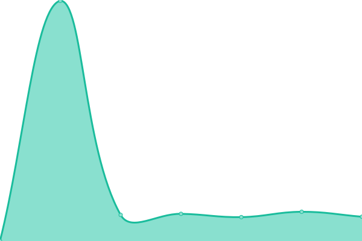 1971ms
     
 | 

<a href="https://uptime.m17.link/history/m17-vk-7">99.31%</a>
    

|  [M17-WAL](https://m17-swdg.net/) | 🟩 Up | [m17-wal.yml](https://github.com/M17-Project/upptime/commits/HEAD/history/m17-wal.yml) | 

 485ms
     
 | 

<a href="https://uptime.m17.link/history/m17-wal">99.80%</a>
    

|  [M17-WWD](https://m17wwd.ddns.net/m17) | 🟥 Down | [m17-wwd.yml](https://github.com/M17-Project/upptime/commits/HEAD/history/m17-wwd.yml) | 

 0ms
     
 | 

<a href="https://uptime.m17.link/history/m17-wwd">0.00%</a>
    

|  [M17-WWR](https://sdrichardson.ddns.net) | 🟥 Down | [m17-wwr.yml](https://github.com/M17-Project/upptime/commits/HEAD/history/m17-wwr.yml) | 

 0ms
     
 | 

<a href="https://uptime.m17.link/history/m17-wwr">0.00%</a>
    

|  [M17-XVF](https://tarxvf.tech) | 🟩 Up | [m17-xvf.yml](https://github.com/M17-Project/upptime/commits/HEAD/history/m17-xvf.yml) | 

 142ms
     
 | 

<a href="https://uptime.m17.link/history/m17-xvf">100.00%</a>
    

|  [M17-YSF](https://m17ysf.dvbr.net) | 🟩 Up | [m17-ysf.yml](https://github.com/M17-Project/upptime/commits/HEAD/history/m17-ysf.yml) | 

 656ms
     
 | 

<a href="https://uptime.m17.link/history/m17-ysf">99.61%</a>
    

|  [M17-ZL3](https://xlx530.hopto.org/m17) | 🟥 Down | [m17-zl-3.yml](https://github.com/M17-Project/upptime/commits/HEAD/history/m17-zl-3.yml) | 

 0ms
     
 | 

<a href="https://uptime.m17.link/history/m17-zl-3">0.00%</a>
    

|  [M17-ZO9](https://m17zona9.duckdns.org/) | 🟥 Down | [m17-zo-9.yml](https://github.com/M17-Project/upptime/commits/HEAD/history/m17-zo-9.yml) | 

 0ms
     
 | 

<a href="https://uptime.m17.link/history/m17-zo-9">0.00%</a>
    

<!--end: status pages-->

[**Visit our status website →**](https://uptime.m17.link)

## 📄 License

- Code: [MIT](./LICENSE) © [M17 Project](https://m17project.org)
- Data in the `./history` directory: [Open Database License](https://opendatacommons.org/licenses/odbl/1-0/)
