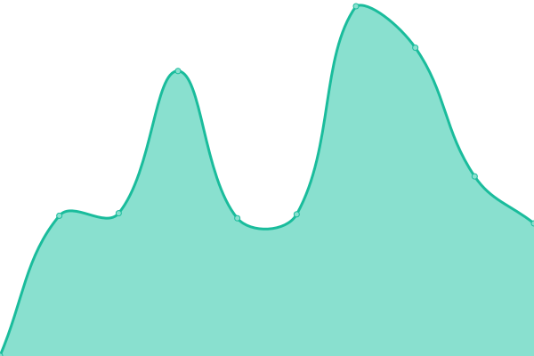
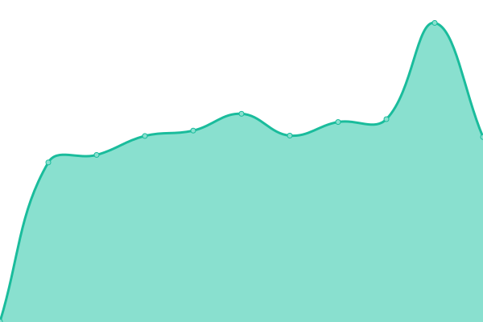
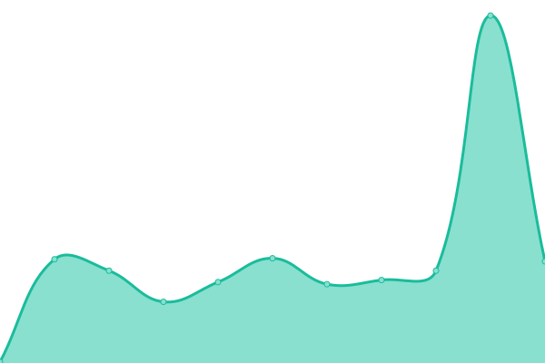
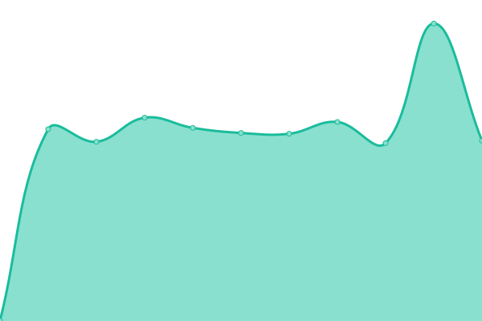

# [📈 Live Status](https://uptime.m17.link): <!--live status--> **🟧 Partial outage**

This repository contains the open-source uptime monitor and status page for [M17 Project](https://m17project.org/), powered by [Upptime](https://github.com/upptime/upptime).

With [Upptime](https://upptime.js.org), you can get your own unlimited and free uptime monitor and status page, powered entirely by a GitHub repository. We use [Issues](https://github.com/M17-Project/upptime/issues) as incident reports, [Actions](https://github.com/M17-Project/upptime/actions) as uptime monitors, and [Pages](https://uptime.m17.link) for the status page.

<!--start: status pages-->
<!-- This summary is generated by Upptime (https://github.com/upptime/upptime) -->
<!-- Do not edit this manually, your changes will be overwritten -->
<!-- prettier-ignore -->
| URL | Status | History | Response Time | Uptime |
| --- | ------ | ------- | ------------- | ------ |
| [M17-190](https://m17.argentina-room.dns-cloud.net/) | 🟩 Up | [m17-190.yml](https://github.com/M17-Project/upptime/commits/master/history/m17-190.yml) | 

 1074ms
     
 | 

   

| [M17-214](https://214.m17.es/) | 🟩 Up | [m17-214.yml](https://github.com/M17-Project/upptime/commits/master/history/m17-214.yml) | 

 2053ms
     
 | 

   

| [M17-224](https://eamaster.xreflector.es/m17/) | 🟩 Up | [m17-224.yml](https://github.com/M17-Project/upptime/commits/master/history/m17-224.yml) | 

 779ms
     
 | 

   

| [M17-ARG](https://m17arg.ddns.net/) | 🟩 Up | [m17-arg.yml](https://github.com/M17-Project/upptime/commits/master/history/m17-arg.yml) | 

 900ms
     
 | 

   

| [M17-AUT](https://m17-aut.xreflector.net/) | 🟩 Up | [m17-aut.yml](https://github.com/M17-Project/upptime/commits/master/history/m17-aut.yml) | 

 806ms
     
 | 

   

| [M17-BEL](https://on0lg.no-ip.org/m17bel/) | 🟩 Up | [m17-bel.yml](https://github.com/M17-Project/upptime/commits/master/history/m17-bel.yml) | 

 926ms
     
 | 

   

| [M17-DEU](https://m17-deu.xreflector.net/) | 🟩 Up | [m17-deu.yml](https://github.com/M17-Project/upptime/commits/master/history/m17-deu.yml) | 

 653ms
     
 | 

   

| [M17-EA7](https://rcveleta.xreflector.es/) | 🟩 Up | [m17-ea-7.yml](https://github.com/M17-Project/upptime/commits/master/history/m17-ea-7.yml) | 

 774ms
     
 | 

   

| [M17-ESP](https://m17spa.xreflector.es/) | 🟥 Down | [m17-esp.yml](https://github.com/M17-Project/upptime/commits/master/history/m17-esp.yml) | 

 819ms
     
 | 

   

| [M17-GAX](https://ea4gax.es/M17/) | 🟩 Up | [m17-gax.yml](https://github.com/M17-Project/upptime/commits/master/history/m17-gax.yml) | 

 727ms
     
 | 

   

| [M17-GBR](https://www.roip.network/m17/) | 🟩 Up | [m17-gbr.yml](https://github.com/M17-Project/upptime/commits/master/history/m17-gbr.yml) | 

 783ms
     
 | 

   

| [M17-ITA](https://m17ita.hblink.it/) | 🟩 Up | [m17-ita.yml](https://github.com/M17-Project/upptime/commits/master/history/m17-ita.yml) | 

 781ms
     
 | 

   

| [M17-KOR](https://m17-kor.dvham.com/) | 🟩 Up | [m17-kor.yml](https://github.com/M17-Project/upptime/commits/master/history/m17-kor.yml) | 

 1028ms
     
 | 

   

| [M17-KP4](https://kp4ca-m17.ddns.net/) | 🟩 Up | [m17-kp-4.yml](https://github.com/M17-Project/upptime/commits/master/history/m17-kp-4.yml) | 

 186ms
     
 | 

   

| [M17-LAT](https://latinos.m17.es/) | 🟩 Up | [m17-lat.yml](https://github.com/M17-Project/upptime/commits/master/history/m17-lat.yml) | 

 546ms
     
 | 

   

| [M17-M17](https://ref.m17.link/) | 🟩 Up | [m17-m17.yml](https://github.com/M17-Project/upptime/commits/master/history/m17-m17.yml) | 

 179ms
     
 | 

   

| [M17-NOR](https://m17.la2k.no/) | 🟩 Up | [m17-nor.yml](https://github.com/M17-Project/upptime/commits/master/history/m17-nor.yml) | 

 668ms
     
 | 

   

| [M17-POL](https://m17.hblink.network/) | 🟩 Up | [m17-pol.yml](https://github.com/M17-Project/upptime/commits/master/history/m17-pol.yml) | 

 813ms
     
 | 

   

| [M17-POR](https://m17.hamradio.pt/) | 🟩 Up | [m17-por.yml](https://github.com/M17-Project/upptime/commits/master/history/m17-por.yml) | 

 876ms
     
 | 

   

| [M17-SAL](https://m17sal.m17.es/) | 🟩 Up | [m17-sal.yml](https://github.com/M17-Project/upptime/commits/master/history/m17-sal.yml) | 

 695ms
     
 | 

   

| [M17-SPA](https://hblinkspain.duckdns.org/mrefd/) | 🟩 Up | [m17-spa.yml](https://github.com/M17-Project/upptime/commits/master/history/m17-spa.yml) | 

 845ms
     
 | 

   

| [M17-URG](https://m17-uruguay.ddns.net/m17/) | 🟩 Up | [m17-urg.yml](https://github.com/M17-Project/upptime/commits/master/history/m17-urg.yml) | 

 833ms
     
 | 

   

| [M17-USA](https://m17-usa.openquad.net/) | 🟩 Up | [m17-usa.yml](https://github.com/M17-Project/upptime/commits/master/history/m17-usa.yml) | 

 229ms
     
 | 

   

<!--end: status pages-->

[**Visit our status website →**](https://uptime.m17.link)

## 📄 License

- Code: [MIT](./LICENSE) © [M17 Project](https://m17project.org)
- Data in the `./history` directory: [Open Database License](https://opendatacommons.org/licenses/odbl/1-0/)
