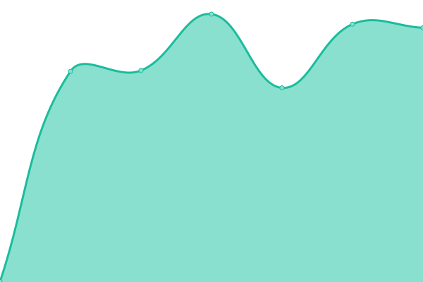
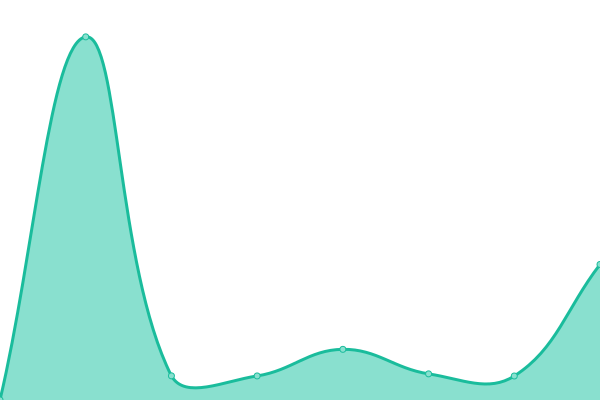

# [📈 Live Status](https://uptime.m17.link): <!--live status--> **🟧 Partial outage**

This repository contains the open-source uptime monitor and status page for [M17 Project](https://m17project.org/), powered by [Upptime](https://github.com/upptime/upptime).

With [Upptime](https://upptime.js.org), you can get your own unlimited and free uptime monitor and status page, powered entirely by a GitHub repository. We use [Issues](https://github.com/M17-Project/upptime/issues) as incident reports, [Actions](https://github.com/M17-Project/upptime/actions) as uptime monitors, and [Pages](https://uptime.m17.link) for the status page.

<!--start: status pages-->
<!-- This summary is generated by Upptime (https://github.com/upptime/upptime) -->
<!-- Do not edit this manually, your changes will be overwritten -->
<!-- prettier-ignore -->
| URL | Status | History | Response Time | Uptime |
| --- | ------ | ------- | ------------- | ------ |
|  [M17-190](https://m17.argentina-room.dns-cloud.net/) | 🟩 Up | [m17-190.yml](https://github.com/M17-Project/upptime/commits/HEAD/history/m17-190.yml) | 

 991ms
     
 | 

<a href="https://uptime.m17.link/history/m17-190">99.59%</a>
    

|  [M17-214](https://214.m17.es/) | 🟥 Down | [m17-214.yml](https://github.com/M17-Project/upptime/commits/HEAD/history/m17-214.yml) | 

 0ms
     
 | 

<a href="https://uptime.m17.link/history/m17-214">0.00%</a>
    

|  [M17-224](https://eamaster.xreflector.es/m17/) | 🟥 Down | [m17-224.yml](https://github.com/M17-Project/upptime/commits/HEAD/history/m17-224.yml) | 

 0ms
     
 | 

<a href="https://uptime.m17.link/history/m17-224">0.00%</a>
    

|  [M17-ARG](https://m17arg.ddns.net/) | 🟥 Down | [m17-arg.yml](https://github.com/M17-Project/upptime/commits/HEAD/history/m17-arg.yml) | 

 0ms
     
 | 

<a href="https://uptime.m17.link/history/m17-arg">100.00%</a>
    

|  [M17-AUT](https://m17-aut.xreflector.net/) | 🟩 Up | [m17-aut.yml](https://github.com/M17-Project/upptime/commits/HEAD/history/m17-aut.yml) | 

 565ms
     
 | 

<a href="https://uptime.m17.link/history/m17-aut">100.00%</a>
    

|  [M17-BEL](https://on0lg.no-ip.org/m17bel/) | 🟩 Up | [m17-bel.yml](https://github.com/M17-Project/upptime/commits/HEAD/history/m17-bel.yml) | 

 654ms
     
 | 

<a href="https://uptime.m17.link/history/m17-bel">100.00%</a>
    

|  [M17-DEU](https://m17-deu.xreflector.net/) | 🟩 Up | [m17-deu.yml](https://github.com/M17-Project/upptime/commits/HEAD/history/m17-deu.yml) | 

 415ms
     
 | 

<a href="https://uptime.m17.link/history/m17-deu">100.00%</a>
    

|  [M17-EA7](https://rcveleta.xreflector.es/) | 🟥 Down | [m17-ea-7.yml](https://github.com/M17-Project/upptime/commits/HEAD/history/m17-ea-7.yml) | 

 0ms
     
 | 

<a href="https://uptime.m17.link/history/m17-ea-7">0.00%</a>
    

|  [M17-ESP](https://m17spa.xreflector.es/) | 🟥 Down | [m17-esp.yml](https://github.com/M17-Project/upptime/commits/HEAD/history/m17-esp.yml) | 

 0ms
     
 | 

<a href="https://uptime.m17.link/history/m17-esp">0.00%</a>
    

|  [M17-GAX](https://ea4gax.es/M17/) | 🟩 Up | [m17-gax.yml](https://github.com/M17-Project/upptime/commits/HEAD/history/m17-gax.yml) | 

 669ms
     
 | 

<a href="https://uptime.m17.link/history/m17-gax">100.00%</a>
    

|  [M17-GBR](https://www.roip.network/m17/) | 🟥 Down | [m17-gbr.yml](https://github.com/M17-Project/upptime/commits/HEAD/history/m17-gbr.yml) | 

 0ms
     
 | 

<a href="https://uptime.m17.link/history/m17-gbr">0.00%</a>
    

|  [M17-ITA](https://m17ita.hblink.it/) | 🟩 Up | [m17-ita.yml](https://github.com/M17-Project/upptime/commits/HEAD/history/m17-ita.yml) | 

 709ms
     
 | 

<a href="https://uptime.m17.link/history/m17-ita">100.00%</a>
    

|  [M17-KOR](https://m17-kor.dvham.com/) | 🟩 Up | [m17-kor.yml](https://github.com/M17-Project/upptime/commits/HEAD/history/m17-kor.yml) | 

 765ms
     
 | 

<a href="https://uptime.m17.link/history/m17-kor">100.00%</a>
    

|  [M17-KP4](https://kp4ca-m17.ddns.net/) | 🟩 Up | [m17-kp-4.yml](https://github.com/M17-Project/upptime/commits/HEAD/history/m17-kp-4.yml) | 

 156ms
     
 | 

<a href="https://uptime.m17.link/history/m17-kp-4">100.00%</a>
    

|  [M17-LAT](https://latinos.m17.es/) | 🟩 Up | [m17-lat.yml](https://github.com/M17-Project/upptime/commits/HEAD/history/m17-lat.yml) | 

 578ms
     
 | 

<a href="https://uptime.m17.link/history/m17-lat">0.00%</a>
    

|  [M17-M17](https://ref.m17.link/) | 🟩 Up | [m17-m17.yml](https://github.com/M17-Project/upptime/commits/HEAD/history/m17-m17.yml) | 

 147ms
     
 | 

<a href="https://uptime.m17.link/history/m17-m17">100.00%</a>
    

|  [M17-NOR](https://m17.la2k.no/) | 🟩 Up | [m17-nor.yml](https://github.com/M17-Project/upptime/commits/HEAD/history/m17-nor.yml) | 

 673ms
     
 | 

<a href="https://uptime.m17.link/history/m17-nor">100.00%</a>
    

|  [M17-POL](https://m17.hblink.network/) | 🟩 Up | [m17-pol.yml](https://github.com/M17-Project/upptime/commits/HEAD/history/m17-pol.yml) | 

 829ms
     
 | 

<a href="https://uptime.m17.link/history/m17-pol">100.00%</a>
    

|  [M17-POR](https://m17.hamradio.pt/) | 🟩 Up | [m17-por.yml](https://github.com/M17-Project/upptime/commits/HEAD/history/m17-por.yml) | 

 818ms
     
 | 

<a href="https://uptime.m17.link/history/m17-por">100.00%</a>
    

|  [M17-SAL](https://m17sal.m17.es/) | 🟩 Up | [m17-sal.yml](https://github.com/M17-Project/upptime/commits/HEAD/history/m17-sal.yml) | 

 586ms
     
 | 

<a href="https://uptime.m17.link/history/m17-sal">100.00%</a>
    

|  [M17-SPA](https://hblinkspain.duckdns.org/mrefd/) | 🟩 Up | [m17-spa.yml](https://github.com/M17-Project/upptime/commits/HEAD/history/m17-spa.yml) | 

 639ms
     
 | 

<a href="https://uptime.m17.link/history/m17-spa">100.00%</a>
    

|  [M17-URG](https://m17-uruguay.ddns.net/m17/) | 🟩 Up | [m17-urg.yml](https://github.com/M17-Project/upptime/commits/HEAD/history/m17-urg.yml) | 

 573ms
     
 | 

<a href="https://uptime.m17.link/history/m17-urg">100.00%</a>
    

|  [M17-USA](https://m17-usa.openquad.net/) | 🟩 Up | [m17-usa.yml](https://github.com/M17-Project/upptime/commits/HEAD/history/m17-usa.yml) | 

 238ms
     
 | 

<a href="https://uptime.m17.link/history/m17-usa">100.00%</a>
    

<!--end: status pages-->

[**Visit our status website →**](https://uptime.m17.link)

## 📄 License

- Code: [MIT](./LICENSE) © [M17 Project](https://m17project.org)
- Data in the `./history` directory: [Open Database License](https://opendatacommons.org/licenses/odbl/1-0/)
